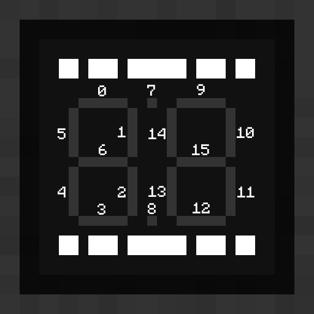

# Seven Segment Display

The seven segment display module is a simplified display module that allows for the easy presentation of numbers. Writing a 16-bit value to the display will activate segments according to the 1 bits of the value. Each of the 16 bits will activate segments of the display in accordance with the below diagram:

Right-clicking on the installed module with a dye will change the color of activated segments to match the dye used.
