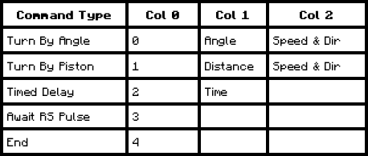
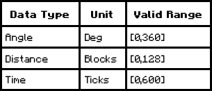

# Sequenced Gearshift


The serial port module is capable of interfacing with a sequenced gearshift to read and write the gearshift's commands.

(Vendor note: A redstone comparator can be used to detect which instruction a sequenced gearshift is currently on)

The table below describes the data associated with each Sequenced Geashift command:



*Writing an End command to a sequenced gearshift will clear all commands after it.

The table below describes the possible value ranges for each data type:



Speed and direction data are 2-bit values. The lower bit is `1` if the input speed is reversed, and zero otherwise. The higher bit is `1` if the input speed is doubled, and zero otherwise.

To interface with a sequenced gearshift, first write the 5-bit address of the target data. The upper 3 bits of the address store the index of the command within the sequenced gearshift, zero indexed, and the lower 2 bits store the column number of the target data, as per Table 1. Subsequent reads will return the data at that row and column, and a subsequent write will overwrite the data.

Attempting to read more values than are available for a given command is considered undefined behavior.

To write a command to a sequenced gearshift, first write the 5-bit address of the target data. Then write the desired value to the serial interface. **Attempting to write to columns that are not valid for a given command is considered undefined behavior.**

## Example

The code example will set the second instruction in an attached sequenced gearshift to Turn By Piston with a distance of 30 blocks, at double the input speed:

```
#DEFINE PORT UP
MOV 4 PORT  # 4 = 0b100. 2nd command is row 1, ID is col 0
MOV 1 PORT  # Set the second command's ID to 1
MOV 5 PORT  # Select the addr of the second command at column 1
MOV 30 PORT # Set column 1 for the first command to 30 blocks
MOV 5 PORT  # Select the addr of the second command at column 2
MOV 2 PORT  # 2 = 0b10. High bit is 1 for doubling, low bit is 0 for forward
```