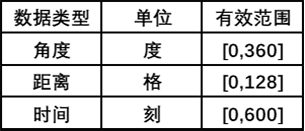

# 可编程齿轮箱

串口模块可以与可编程齿轮箱交互，以读写齿轮箱的指令。

（供应方注：红石比较器可以用来探测可编程齿轮箱当前在执行哪条指令）

与可编程齿轮箱指令有关的数据表格如下：

向可编程齿轮箱写入停止指令会清空它下面的所有指令。

各个数据类型值范围表格如下：

速度与方向数据是2位二进制值。
低位为`1`代表输入的速度取反，为`0`则不取反。
高位为`1`代表输入的速度加倍，为`0`则不加倍。

与可编程齿轮箱交互需先写入目标数据的5位二进制地址。地址的高3位为可编程齿轮箱内指令的序号，从0开始。低2位为目标数据的列号，参考表1。后续读取操作会返回相应位置处的数据，后续写入操作会覆写此数据。

试图读取超出给定指令可用值范围的值是未定义行为。

向可编程齿轮箱写入指令需先写入目标数据的5位二进制地址，然后向串口模块写入所需值。**试图向指令不可用栏写入数据是未定义行为。**

## 样例

下面的示例代码会把附着的可编程齿轮箱的第二条指令设定为“驱动活塞”，距离为30格，速度为输入速度的两倍：

`#DEFINE PORT UP`
`MOV 4 PORT  #`4的二进制为0b100。第二条指令在第1 行，ID在第0列
`MOV 1 PORT  #`将第二条指令的第0列（ID）设置为1
`MOV 5 PORT  #`选中第二条指令的第1列为地址
`MOV 30 PORT #`将第二条指令的第1列（距离）设定 为30方块
`MOV 5 PORT  #`选中第二条指令的第2列为地址
`MOV 2 PORT  #`2的二进制是0b10。高位是1代表速度翻倍，低位是0代表向前
