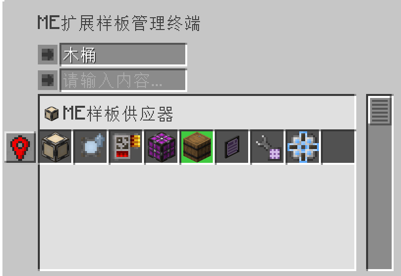
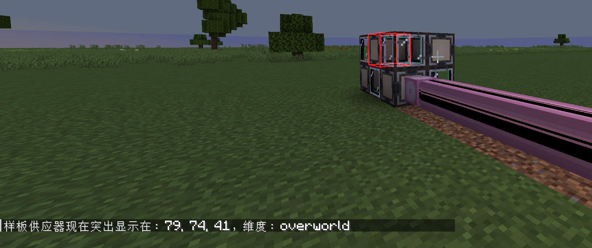

---
navigation:
    parent: epp_intro/epp_intro-index.md
    title: ME扩展样板管理终端
    icon: extendedae:ex_pattern_access_part
categories:
- extended devices
item_ids:
- extendedae:ex_pattern_access_part
- extendedae:wireless_ex_pat
---

# ME扩展样板管理终端

与普通<ItemLink id="ae2:pattern_access_terminal" />相比，ME扩展样板管理终端提供了3个额外的功能。

<Row gap="20">
<GameScene zoom="6" background="transparent">
<ImportStructure src="../structure/cable_ex_pattern_terminal.snbt"></ImportStructure>
<IsometricCamera yaw="180"></IsometricCamera>
</GameScene>
<ItemImage id="extendedae:wireless_ex_pat" scale="4"></ItemImage>
</Row>

## 更好的搜索模式

你可以用输入/输出中的原料名称搜索样板。

## 高亮显示

有时候依然很难找到想要的样板，因为其总是成组呈现。
不过扩展样板管理终端现在也可以在GUI中突出显示匹配的样板了。

## 在世界中高亮显示供应器的位置

在进行大型合成任务时，发现哪个样板供应器被卡住是很烦人的。扩展样板管理终端可以在世界上突出显示相应的样板供应器，你将更容易地找到它。

