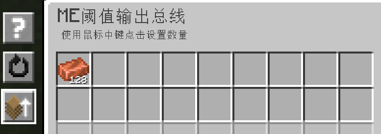
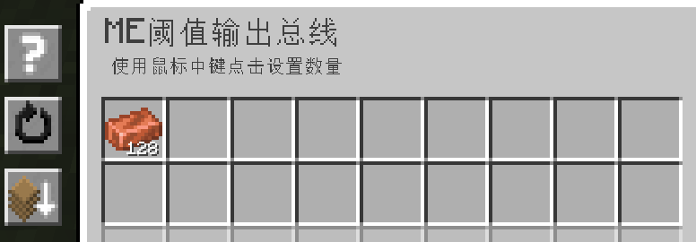

---
navigation:
    parent: epp_intro/epp_intro-index.md
    title: ME阈值输出总线
    icon: extendedae:threshold_export_bus
categories:
- extended devices
item_ids:
- extendedae:threshold_export_bus
---

# ME阈值输出总线

<GameScene zoom="8" background="transparent">
  <ImportStructure src="../structure/cable_threshold_export_bus.snbt"></ImportStructure>
</GameScene>

当存储在ME网络中的物品数量高于/低于阈值时，ME阈值输出总线才会运行。

## 示例

铜的阈值设置为128，因此当网络中存储的铜数量超过128时，才会输出铜。

同上，将模式设置为“低于阈值时工作"，当铜的储量低于128时，才会输出铜。
