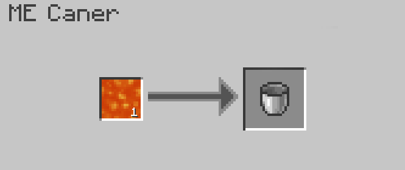

---
navigation:
    parent: epp_intro/epp_intro-index.md
    title: ME Caner
    icon: extendedae:caner
categories:
- extended devices
item_ids:
- extendedae:caner
---

# ME Caner

<BlockImage id="extendedae:caner" scale="8"></BlockImage>

ME Caner is a machine that "canning" stuffs, including fluids, Mekanism gas, Botania mana and even Energy!

The first slot is for what to fill, and the second slot is for what to be filled.

It needs energy to run and every operation costs 80 AE.

It only fills fluids by default, you need to install corresponding addon to make it fill other stuffs.

### Support addons:
- Applied Flux
- Applied Mekanistics
- Applied Botanics Addon

## Autocrafting with ME Caner

Only the top and bottom side can accept energy and connect to network.

<GameScene zoom="6" background="transparent">
  <ImportStructure src="../structure/caner_example.snbt"></ImportStructure>
</GameScene>

A simple setup for ME Caner. ME Caner will auto eject the filled item when it accepts the ingredients from <ItemLink id="ae2:pattern_provider" />.

<GameScene zoom="6" background="transparent">
  <ImportStructure src="../structure/caner_auto.snbt"></ImportStructure>
</GameScene>

The pattern must only contain the stuff to fill and the container to be filled. Here are some examples:

Fill water bucket:

Empower Energy Tablet (Need Applied Flux installed):

## Uncaning

ME Caner also can drain stuffs from container in Empty mode. You need to switch the inputs and outputs in pattern.
