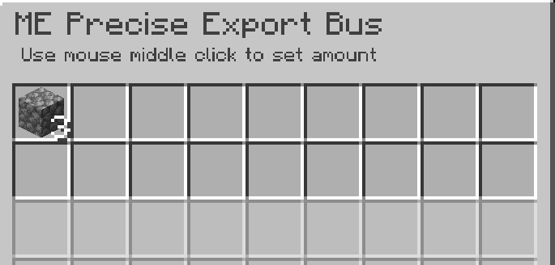
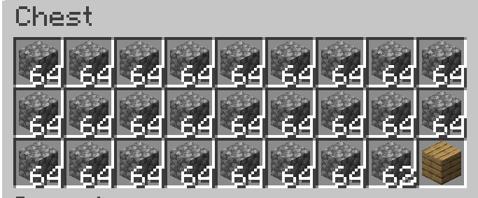

---
navigation:
    parent: epp_intro/epp_intro-index.md
    title: ME Precise Export Bus
    icon: extendedae:precise_export_bus
categories:
- extended devices
item_ids:
- extendedae:precise_export_bus
---

# ME Precise Export Bus

<GameScene zoom="8" background="transparent">
  <ImportStructure src="../structure/cable_precise_export_bus.snbt"></ImportStructure>
</GameScene>

ME Precise Export Bus exports items/fluids in specified quantities. It only exports if the container can fully accept the entire output.

## Example

This means exporting 3 cobblestones per operation. It stops exporting when cobblestones amount is lower than 3 in network.

It also stops exporting when the target container can't hold all it exported. The chest only can hold 2 more cobblestones now, so the export bus stops.
