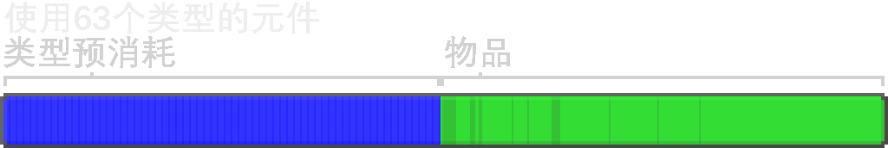

---
navigation:
  parent: ae2-mechanics/ae2-mechanics-index.md
  title: 字节与类型
  icon: creative_item_cell
---

# 字节与类型

<Row>
    <ItemImage id="item_storage_cell_1k" scale="4" />

    <ItemImage id="item_storage_cell_4k" scale="4" />

    <ItemImage id="item_storage_cell_16k" scale="4" />

    <ItemImage id="item_storage_cell_64k" scale="4" />

    <ItemImage id="item_storage_cell_256k" scale="4" />
  </Row>

[存储元件](../items-blocks-machines/storage_cells.md)的两大属性就是*字节*和*类型*。字节是存储元件内事物总量的量度，和现实生活的电脑类似。类型是元件中存有物品不同*类型*数目的量度。每个类型都代表一种物品，因此4096个圆石是1个类型，而16柄带有不同魔咒的剑是16个类型。

每个存储元件都能存储固定量的数据。每个类型都会预先占用若干字节（因元件种类而异），每个物品占用1位，也即8个物品占用1字节，一组64个物品占用8字节，不受ME网络外该物品堆叠数影响。例如，64个完全一致的鞍和64个石头占用的空间一致。

再说一遍，每个物品占用1位，8个物品占用1字节。对于流体元件而言，8桶流体占用1字节。

许多人都抱怨元件存储的类型太少了，但这是一种**_必要的限制_**。元件将数据存在物品自身的NBT标签中，使得它们相对稳定。但是，这也意味着在单个元件中存储过多数据会导致瞬间向玩家传输过多数据，从而引起类似原版Minecraft“禁人书”的现象。此外，在网络中装有过多类型会增加排序和物品处理的负载。然而，这一限制并不会影响日常使用。装满元件的<ItemLink id="drive" />站有共计630个类型，只要不用其存储大量独特且不可堆叠的物品就已经能算很多了。

也正因此，类型的存在是为“坚决阻止”诸如向ME系统中直接倾倒成百上千个生物农场刷来的各种受损的盔甲与工具的行为。每一件拥有独特耐久度和魔咒的盔甲只能分存于不同条目，从而导致内存膨胀。推荐在这些物品进入系统前就将其过滤出去。

直接瞄准最高级的存储元件通常不是什么好主意：这些元件消耗更多资源，但类型数没有增加。这也表明各种大小的元件因上述权衡取舍，而在游戏后期都还有用武之地。

各级存储元件的容量与消耗比对表格如下。

## 存储元件容量 vs. 消耗

| 元件                                     |    字节 |  类型 | 每类型占用字节 | 赛特斯石英 | 红石 |   金 |      荧石 |
| ---------------------------------------- | ------: | ----: | -------------: | -----: | -------: | ---: | --------: |
| <ItemLink id="item_storage_cell_1k" />   |   1,024 |    63 |              8 |      4 |        5 |    1 |         0 |
| <ItemLink id="item_storage_cell_4k" />   |   4,096 |    63 |             32 |  14.25 |       20 |    3 |         0 |
| <ItemLink id="item_storage_cell_16k" />  |  16,384 |    63 |            128 |     45 |       61 |    9 |         4 |
| <ItemLink id="item_storage_cell_64k" />  |  65,536 |    63 |            512 | 137.25 |      184 |   27 |        16 |
| <ItemLink id="item_storage_cell_256k" /> | 262,144 |    63 |           2048 |    414 |      553 |   81 |        48 |

## 存储容量与类型数变化关系

每类型预先占用量设计为：存有1个类型的元件的容量是存满63个元件的容量的两倍。

| 元件                                     |                       使用1个类型时总容量 |                        使用63个类型时总容量 |
| ---------------------------------------- | ----------------------------------------: | ------------------------------------------: |
| <ItemLink id="item_storage_cell_1k" />   |                                     8,128 |                                       4,160 |
| <ItemLink id="item_storage_cell_4k" />   |                                    32,512 |                                      16,640 |
| <ItemLink id="item_storage_cell_16k" />  |                                   130,048 |                                      66,560 |
| <ItemLink id="item_storage_cell_64k" />  |                                   520,192 |                                     266,240 |
| <ItemLink id="item_storage_cell_256k" /> |                                 2,080,768 |                                   1,064,960 |

