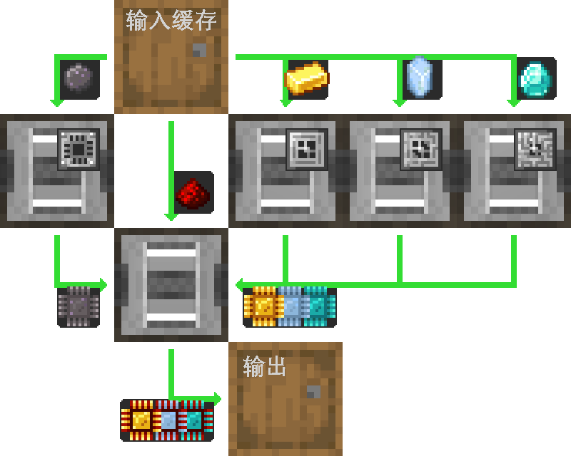

---
navigation:
  parent: example-setups/example-setups-index.md
  title: 处理器自动化
  icon: logic_processor
---

# 自动化生产处理器

自动化[处理器](../items-blocks-machines/processors.md)有多种方式，如下是其一。

此通用设计也可用任意种类的物流管道、导管、管道或其他不同称呼的同类事物完成，仅要求这些管道能设置过滤。

如下则是仅使用AE2的实现细节，其中使用了[“管道”子网络](pipe-subnet.md)。

需注意，此设施使用了<ItemLink id="pattern_provider" />，也即需与你的[自动合成](../ae2-mechanics/autocrafting.md)设施配合使用。如需独立自动化处理器，则应将样板供应器换为木桶，并将材料直接放入上方的木桶中。

此设计也能在之前的AE2版本中使用，因为就算<ItemLink id="inscriber" />对面敏感，管道子网络仍能对正确的面输入或输出。

## 样板编码的教训

通常情况下，所需的[样板](../items-blocks-machines/patterns.md)和**JEI中所见的**，或是按下+按钮时输出的配方**对不上**。在本节的情况中，JEI会输出2个样板，其一是制造电路板，其二是最终的组装步骤，且第一个样板会包含一个[压印模板](../items-blocks-machines/presses.md)。很明显不是我们需要的，它不符合设施的功能。我们需要的是1个样板，输入原材料然后输出压印好的处理器。而压印模板已经在压印器中，样板不应当包含它。

---

<GameScene zoom="4" interactive={true}>
  <ImportStructure src="../assets/assemblies/processor_automation.snbt" />

  <BoxAnnotation color="#dddddd" min="5 1 0" max="6 2 1" thickness=".05">
        （1）样板供应器：默认配置，装有相关处理样板。

        <Row>
            
            
            
        </Row>
  </BoxAnnotation>

  <BoxAnnotation color="#dddddd" min="4.7 2 0" max="5 3 1" thickness=".05">
        （2）存储总线#1：默认配置。
  </BoxAnnotation>

  <BoxAnnotation color="#dddddd" min="4 1 0" max="4.3 2 1" thickness=".05">
        （3）输出总线#1：过滤硅，装有2张加速卡。
        <Row><ItemImage id="silicon" scale="2" /> <ItemImage id="speed_card" scale="2" /></Row>
  </BoxAnnotation>

  <BoxAnnotation color="#dddddd" min="4 4 0" max="4.3 3 1" thickness=".05">
        （4）输出总线#2：过滤金锭，装有2张加速卡。
        <Row><ItemImage id="minecraft:gold_ingot" scale="2" /> <ItemImage id="speed_card" scale="2" /></Row>
  </BoxAnnotation>

  <BoxAnnotation color="#dddddd" min="4 5 0" max="4.3 4 1" thickness=".05">
        （5）输出总线#3：过滤赛特斯石英水晶，装有2张加速卡。
        <Row><ItemImage id="certus_quartz_crystal" scale="2" /> <ItemImage id="speed_card" scale="2" /></Row>
  </BoxAnnotation>

  <BoxAnnotation color="#dddddd" min="4 6 0" max="4.3 5 1" thickness=".05">
        （6）输出总线#4：过滤钻石，装有2张加速卡。
        <Row><ItemImage id="minecraft:diamond" scale="2" /> <ItemImage id="speed_card" scale="2" /></Row>
  </BoxAnnotation>

  <BoxAnnotation color="#dddddd" min="2.3 3 0" max="2 2 1" thickness=".05">
        （7）输出总线#5：过滤红石粉，装有2张加速卡。
        <Row><ItemImage id="minecraft:redstone" scale="2" /> <ItemImage id="speed_card" scale="2" /></Row>
  </BoxAnnotation>

  <BoxAnnotation color="#dddddd" min="4 1 0" max="3 2 1" thickness=".05">
        （8）压印器#1：默认配置。装有硅压印模板和4张加速卡。
        <Row><ItemImage id="silicon_press" scale="2" /> <ItemImage id="speed_card" scale="2" /></Row>
  </BoxAnnotation>

  <BoxAnnotation color="#dddddd" min="4 3 0" max="3 4 1" thickness=".05">
        （9）压印器#2：默认配置。装有逻辑压印模板和4张加速卡。
        <Row><ItemImage id="logic_processor_press" scale="2" /> <ItemImage id="speed_card" scale="2" /></Row>
  </BoxAnnotation>

  <BoxAnnotation color="#dddddd" min="4 4 0" max="3 5 1" thickness=".05">
        （10）压印器#3：默认配置。装有计算压印模板和4张加速卡。
        <Row><ItemImage id="calculation_processor_press" scale="2" /> <ItemImage id="speed_card" scale="2" /></Row>
  </BoxAnnotation>

  <BoxAnnotation color="#dddddd" min="4 5 0" max="3 6 1" thickness=".05">
        （11）压印器#4：默认配置。装有工程压印模板和4张加速卡。
        <Row><ItemImage id="engineering_processor_press" scale="2" /> <ItemImage id="speed_card" scale="2" /></Row>
  </BoxAnnotation>

  <BoxAnnotation color="#dddddd" min="2 2 0" max="1 3 1" thickness=".05">
        （12）压印器#5：默认配置。装有4张加速卡。
        <ItemImage id="speed_card" scale="2" />
  </BoxAnnotation>

  <BoxAnnotation color="#dddddd" min="2.7 2 0" max="3 1 1" thickness=".05">
        （13）输入总线#1：默认配置，装有2张加速卡。
        <ItemImage id="speed_card" scale="2" />
  </BoxAnnotation>

  <BoxAnnotation color="#dddddd" min="2.7 4 0" max="3 3 1" thickness=".05">
        （14）输入总线#2：默认配置，装有2张加速卡。
        <ItemImage id="speed_card" scale="2" />
  </BoxAnnotation>

  <BoxAnnotation color="#dddddd" min="2.7 5 0" max="3 4 1" thickness=".05">
        （15）输入总线#3：默认配置，装有2张加速卡。
        <ItemImage id="speed_card" scale="2" />
  </BoxAnnotation>

  <BoxAnnotation color="#dddddd" min="2.7 6 0" max="3 5 1" thickness=".05">
        （16）输入总线#4：默认配置，装有2张加速卡。
        <ItemImage id="speed_card" scale="2" />
  </BoxAnnotation>

  <BoxAnnotation color="#dddddd" min="2 3 0" max="1 3.3 1" thickness=".05">
        （17）存储总线#2：默认配置。
  </BoxAnnotation>

  <BoxAnnotation color="#dddddd" min="2 1.7 0" max="1 2 1" thickness=".05">
        （18）存储总线#3：默认配置。
  </BoxAnnotation>

  <BoxAnnotation color="#dddddd" min="1 2 0" max="0.7 3 1" thickness=".05">
        （19）输入总线#5：默认配置，装有2张加速卡。
        <ItemImage id="speed_card" scale="2" />
  </BoxAnnotation>

  <BoxAnnotation color="#dddddd" min="5 0.7 0" max="6 1 1" thickness=".05">
        （20）存储总线#4：默认配置。
  </BoxAnnotation>

<BoxAnnotation color="#dddddd" min="3.3 2.7 0.3" max="3.7 3 0.7" thickness=".05">
        石英纤维能为全部3台压印器供能，压印器与线缆功能类似，能够传输能量。
  </BoxAnnotation>

<DiamondAnnotation pos="7 1.5 0.5" color="#00ff00">
        至主网络
    </DiamondAnnotation>

  <IsometricCamera yaw="185" pitch="5" />
</GameScene>

## 配置

* <ItemLink id="pattern_provider" />（1）处于默认配置，装有相应<ItemLink id="processing_pattern" />。
  注意此类样板需直接从原材料加工为完整的处理器，且**不应**包含[压印模板](../items-blocks-machines/presses.md)。

  
  
  

* <ItemLink id="storage_bus" />（2、17、18、20）处于默认配置。
* <ItemLink id="export_bus" />（3-7）设置为过滤相应材料。均装有2张<ItemLink id="speed_card" />。
    <Row>
      <ItemImage id="silicon" scale="2" />
      <ItemImage id="minecraft:gold_ingot" scale="2" />
      <ItemImage id="certus_quartz_crystal" scale="2" />
      <ItemImage id="minecraft:diamond" scale="2" />
      <ItemImage id="minecraft:redstone" scale="2" />
    </Row>
* <ItemLink id="import_bus" />（13-16、19）处于默认配置。均装有2张<ItemLink id="speed_card" />。
* <ItemLink id="inscriber" />处于默认配置。装有相应[压印模板](../items-blocks-machines/presses.md)和4张<ItemLink id="speed_card" />。
   <Row>
     <ItemImage id="silicon_press" scale="2" />
     <ItemImage id="logic_processor_press" scale="2" />
     <ItemImage id="calculation_processor_press" scale="2" />
     <ItemImage id="engineering_processor_press" scale="2" />
   </Row>

## 工作原理

1. <ItemLink id="pattern_provider" />将材料存入木桶。
2. 第一个[管道子网络](pipe-subnet.md)（橙色）从木桶中抽取硅、红石粉，以及相应压印器的材料（金锭、赛特斯石英水晶、钻石）并存入相应<ItemLink id="inscriber" />。
3. 前四个<ItemLink id="inscriber" />制造<ItemLink id="printed_silicon" />、<ItemLink id="printed_logic_processor" />、<ItemLink id="printed_calculation_processor" />，以及<ItemLink id="printed_engineering_processor" />。
4. 第二个和第三个[管道子网络](pipe-subnet.md)（绿色）将电路板和硅板从前四个<ItemLink id="inscriber" />中取出并放入第五个也是最终工序<ItemLink id="inscriber" />。
5. 第五个<ItemLink id="inscriber" />组装[处理器](../items-blocks-machines/processors.md)。
6. 第四个[管道子网络](pipe-subnet.md)（紫色）将处理器送入样板供应器，并返回至主网络。