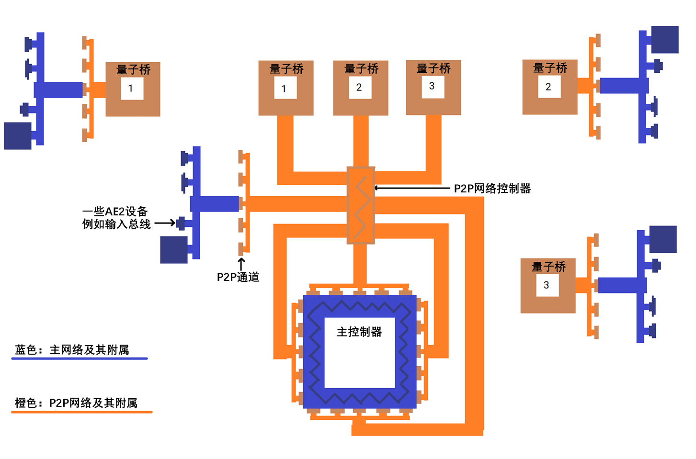

---
navigation:
  parent: items-blocks-machines/items-blocks-machines-index.md
  title: P2P通道
  icon: me_p2p_tunnel
  position: 210
categories:
- devices
item_ids:
- ae2:me_p2p_tunnel
- ae2:redstone_p2p_tunnel
- ae2:item_p2p_tunnel
- ae2:fluid_p2p_tunnel
- ae2:fe_p2p_tunnel
- ae2:light_p2p_tunnel
---

# P2P通道

<GameScene zoom="6" background="transparent">
  <ImportStructure src="../assets/assemblies/p2p_tunnels.snbt" />
  <IsometricCamera yaw="195" pitch="30" />
</GameScene>

P2P通道是在网络中传输物品、流体、红石信号、能量、光、[频道](../ae2-mechanics/channels.md)等事物的一种方式，且不必直接与网络交互。P2P通道有多种变种，每种只能传输一类事物。可将它们看做能远距直接连接两方块的传送门。这种连接有确定的输入和输出端，而并非双向的。

例如，朝向物品P2P通道的漏斗和直接放在木桶上的漏斗没有区别，物品可以正常传输。

<GameScene zoom="4" background="transparent">
  <ImportStructure src="../assets/assemblies/p2p_hopper_barrel.snbt" />
  <IsometricCamera yaw="195" pitch="30" />
</GameScene>

但是，相邻放置的两个木桶不会互相传输物品。

<GameScene zoom="4" background="transparent">
  <ImportStructure src="../assets/assemblies/p2p_barrel_barrel.snbt" />
  <IsometricCamera yaw="195" pitch="30" />
</GameScene>

也有其他变种，如红石P2P通道。

<GameScene zoom="4" background="transparent">
  <ImportStructure src="../assets/assemblies/p2p_redstone.snbt" />
  <IsometricCamera yaw="195" pitch="30" />
</GameScene>

## P2P通道的类型与调谐

<GameScene zoom="6" background="transparent">
  <ImportStructure src="../assets/assemblies/p2p_tunnels.snbt" />
  <IsometricCamera yaw="180" pitch="90" />
</GameScene>

P2P通道有许多种类，其中只有ME P2P通道才可直接合成，其他则需要以物品右击任意P2P通道：
- ME P2P通道需手持任意[线缆](../items-blocks-machines/cables.md)右击调谐
- 红石P2P通道需手持红石元件右击调谐
- 物品P2P通道需手持箱子或漏斗右击调谐
- 流体P2P通道需手持铁桶或玻璃瓶右击调谐
- 能源P2P通道需手持能量容器右击调谐
- 光P2P通道需手持火把或荧石右击调谐

某些P2P通道的特性比较奇怪。比如，ME P2P通道的频道无法穿过其他ME P2P通道，能源P2P通道则会通过自身[能量](../ae2-mechanics/energy.md)消耗而克扣经过能量的5%（FE、E）。

## P2P通道的最常见用途

P2P通道的最常见用途便是通过ME P2P通道以高效传输[频道](../ae2-mechanics/channels.md)。传输大量频道不再需要一束致密线缆了，一根致密线缆就已足够。

在此示例中，8个ME P2P通道输入端会从主网络的<ItemLink id="controller" />中传输256（8*32）个频道，其余8个ME P2P输出端则将其送至其他位置。注意每个P2P通道输入和输出端只占用1个频道。如此就可在单根线缆中传输大量频道了。而因为P2P通道均位于专用[子网络](../ae2-mechanics/subnetworks.md)中，它们甚至不会占用主网络的频道！此外，注意P2P通道可直接面向控制器放置，可在两者间放入[致密线缆](../items-blocks-machines/cables.md#smart-cable)以可视化被传输的频道。

<GameScene zoom="4" interactive={true}>
  <ImportStructure src="../assets/assemblies/p2p_compact_channels.snbt" />

  <BoxAnnotation color="#dddddd" min="1.3 1.3 6.3" max="2 2.7 6.7">
        石英纤维会在主网络和P2P子网络间传输能量。
  </BoxAnnotation>

  <IsometricCamera yaw="225" pitch="30" />
</GameScene>

另一示例（与[量子桥](quantum_bridge.md)共同运用）可见下方用画图画出来的粗略图案：

## 嵌套

但是，这一系统无法在单根线缆中传输无限频道。ME P2P通道的频道无法穿过其他ME P2P通道，也因此无法嵌套它们。注意位于外层红色线缆上的ME P2P通道处于离线状态。这一性质仅适用于ME P2P通道，其他种类的P2P通道则可穿过ME P2P通道，如此连接的红石P2P通道能正常工作。

<GameScene zoom="4" background="transparent">
  <ImportStructure src="../assets/assemblies/p2p_nesting.snbt" />
  <IsometricCamera yaw="225" pitch="30" />
</GameScene>

## 连接

<GameScene zoom="6" background="transparent">
  <ImportStructure src="../assets/assemblies/p2p_linking_frequency.snbt" />
  <IsometricCamera yaw="195" pitch="30" />
</GameScene>

P2P通道连接可用<ItemLink id="memory_card" />创建。连接频率会在P2P通道背面显示为2x2的颜色阵列。
- Shift右击以生成新P2P连接频率。
- 右击以粘贴设置或升级卡，或连接频率。

Shift右击的通道为输入端，右击的通道为输出端。允许存在多个输出端，但ME P2P通道传输的频道会分给各输出端，而非每个输出端都获得所有频道，如此可避免频道复制。

## 配方

<RecipeFor id="me_p2p_tunnel" />