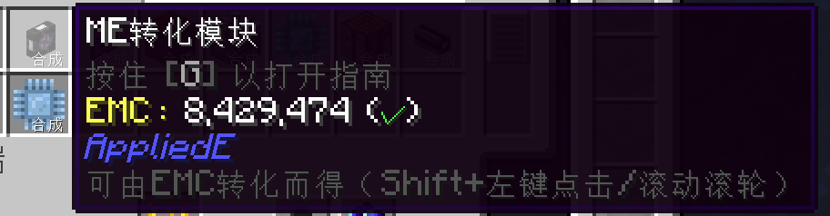
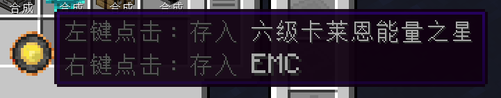
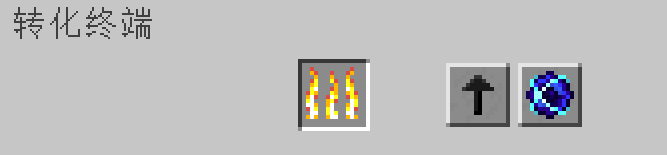
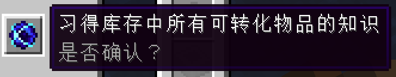

---
navigation:
  parent: appliede-index.md
  title: 转化终端
  icon: transmutation_terminal
  position: 20
categories:
  - appliede
item_ids:
  - appliede:transmutation_terminal
  - appliede:wireless_transmutation_terminal
---

# 转化终端

<GameScene zoom="8" background="transparent">
  <ImportStructure src="assemblies/transmutation_terminal.snbt" />
</GameScene>

到目前为止，我们已经了解了ME网络如何通过自动合成设施和AppliedE的各种[转化设备](transmutation_devices.md)将EMC转化为物品。但有一个问题仍未解决：玩家自己怎么在ME系统中直接操控EMC呢？

这个问题的答案是**ME转化终端**：一台拥有ProjectE<ItemLink id="projecte:transmutation_table" />大多数功能的，集成至相连ME网络中的终端。

首先，*你*可以在此终端内直接使用网络中的EMC转化出已习得的物品，而不需在常规的物品存储容器中预先放有它们。你也可以在此终端内清空和装载卡莱恩能量之星等能够存储EMC的物品。

终端的界面中有一个以火焰标识的槽位。和转化桌中的火焰槽位一样，物品可在此转化为EMC进入终端。界面上还有两个按钮，它们的功能就要强大许多。

左侧的箭头按钮能切换Shift左击的功能：物品如何进入终端。如果箭头指向上方的基础终端网格，则Shift左击的物品会以普通物品的形式进入终端；如果箭头指向左侧的转化槽，则Shift左击的物品组会以EMC的形式进入网络的统一EMC存储空间，操作者也会同时习得相应物品的知识。

最后，按下以奇点标识的按钮后，操作者会习得终端内所有未习得的物品。不过，这么做也有其代价：存储空间中必须存在至少一个待习得的物品，且该物品会立即转化为EMC。根据物品对应EMC值的不同，随之而来的可能是相当庞大的能量消耗，操作前需要三思。按钮也会提醒你，通过它习得所有物品前要多加思虑。

## 配方

<RecipeFor id="appliede:transmutation_terminal" />
