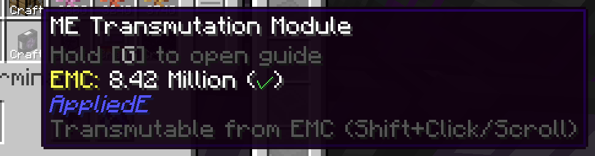
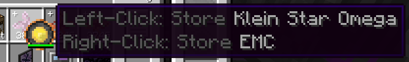
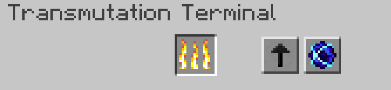
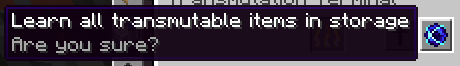

---
navigation:
  parent: appliede-index.md
  title: Transmutation Terminal
  icon: transmutation_terminal
  position: 20
categories:
  - appliede
item_ids:
  - appliede:transmutation_terminal
  - appliede:wireless_transmutation_terminal
---

# Transmutation Terminal

<GameScene zoom="8" background="transparent">
  <ImportStructure src="assemblies/transmutation_terminal.snbt" />
</GameScene>

While so far we've been able to address the ability of ME networks to convert EMC into items through auto-crafting and
the various [transmutation devices](transmutation_devices.md) offered by AppliedE, the question remains: how does one
manipulate one's EMC directly as a player through their ME system?

The answer to this question comes in the form of the **ME Transmutation Terminal**, a terminal which provides the user
with much of the functionality of ProjectE's <ItemLink id="projecte:transmutation_table" />, but integrated within the
ME network behind it.

For starters, with this terminal, *you* as the player are able to directly extract known transmutable items out of
stored EMC rather than requiring them to exist prior in regular item storage. You can also fill and empty Klein stars
and other EMC-storing items via this terminal.

The screen of the terminal also includes the familiar fiery slot of the Transmutation Table, through which items are
typically converted into EMC, and this slot works much the same for the terminal as well. However, the screen also
features two extra buttons which provide the terminal with some extra powerful features.

The arrow button on the left toggles where shift-clicked stacks of items go in relation to the terminal. If the arrow
points upwards towards the overall terminal grid, then shift-clicked items will go into that grid and to regular item
storage. If the arrow points left to the transmutation slot, however, any shift-clicked stacks will be converted into
EMC to be sent into the total network-wide store of EMC, while also learning the item for the user if it has not already
been learned.

Lastly, the remaining button with the singularity allows the user of the terminal to automatically learn every item in
storage that has not already been learned for transmutation. However, this comes at a potentially hefty cost: items can
only be learned if at least one of them exists in storage, and that one item of each will be immediately transmuted to
EMC, incurring potentially massive energy use depending on just how much EMC an item is worth. For this reason, caution
is recommended, and the button will encourage you to think twice before you decide to learn everything through it.

## Recipe

<RecipeFor id="appliede:transmutation_terminal" />
