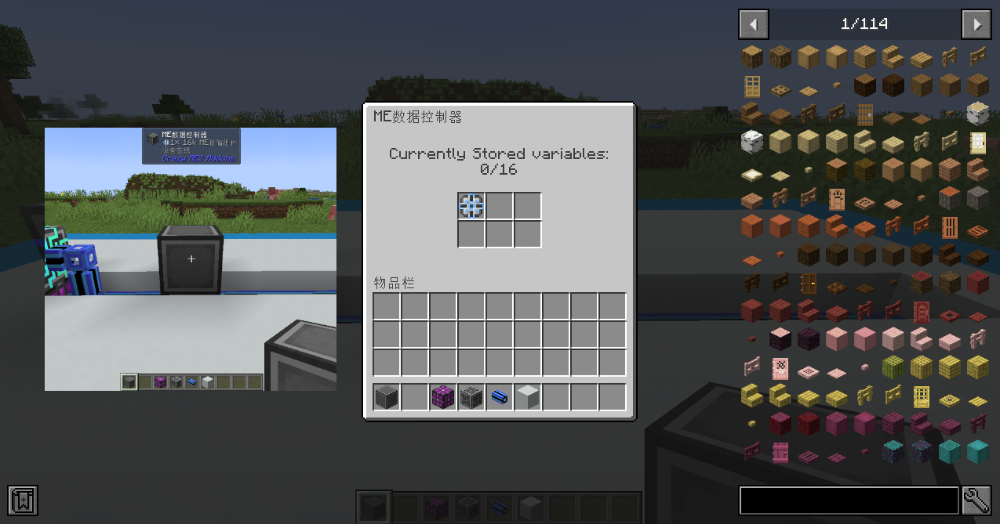
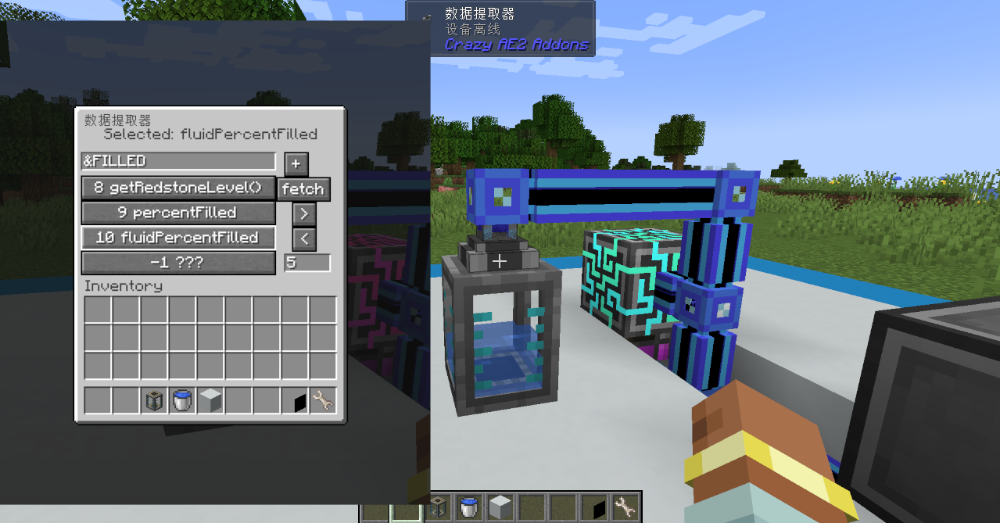
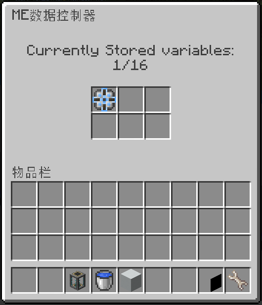
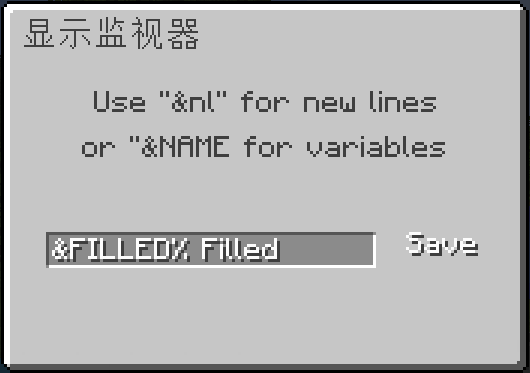
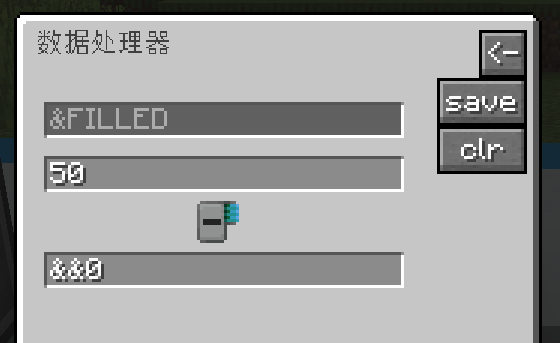
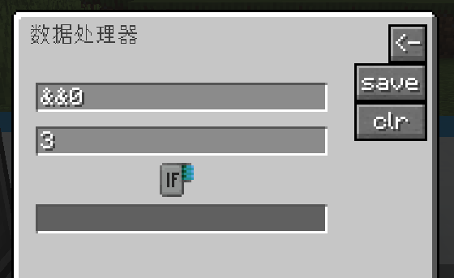
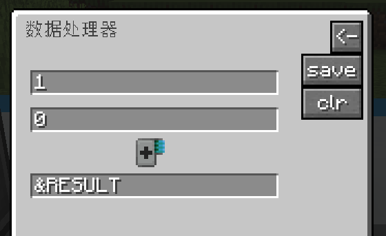
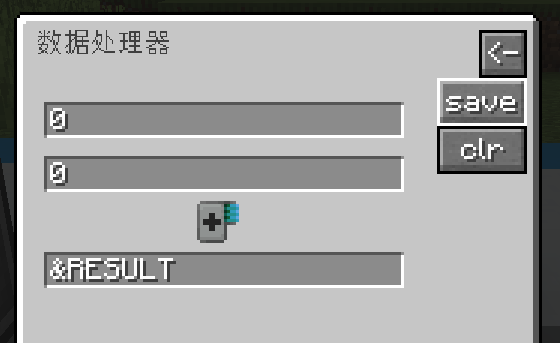
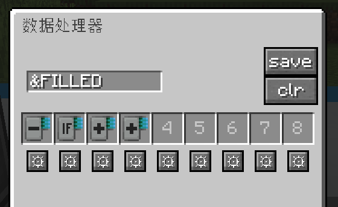

---
navigation:
  parent: crazyae2addons_index.md
  title: 数据变量教程
  icon: crazyae2addons:data_processor
categories:
  - Data Variables
item_ids:
  - crazyae2addons:logic_card
  - crazyae2addons:add_card
  - crazyae2addons:sub_card
  - crazyae2addons:mul_card
  - crazyae2addons:div_card
  - crazyae2addons:min_card
  - crazyae2addons:max_card
  - crazyae2addons:bsr_card
  - crazyae2addons:bsl_card
  - crazyae2addons:hit_card
  - crazyae2addons:hif_card
---

# 数据变量的新手指南

欢迎！本教程旨在教导阅读者如何使用Crazy AE2 Addons中的数据变量，就算你对编程一无所知也没有关系。

---

## 数据变量是什么？

数据变量是存储在ME网络内部的数。可以：
- 用显示监视器和数据追踪器进行监视。
- 用数据提取器进行更新。
- 用数据处理器和独立式数据处理器进行运算和加工。

可以把它们想成是网络内部的隐形计数器或传感器。

---

## 创建你的第一个变量

1. **放置一个ME数据控制器**
    - 所有变量都存储在这个方块里。
    - 确保它连接到了ME网络，且其内部至少有1个AE2的存储组件，比如1k存储组件。

2. **使用数据提取器**
    - 对着机器或储罐放置数据提取器。
    - 打开其界面，并点击**抓取**/**Fetch**。
    - 选择想要监测的数，如能量水平、加工进度等。
    - 在界面右下角设置每次读取的间隔，以刻计，比如5。
    - 给变量起个名！输入一个简单的名称，比如说`&FILLED`（只接受全大写拉丁字母，不允许空格，必须以`&`起始），然后点击“+”。

3. **检查你的变量**
    - 打开ME数据控制器的界面。
    - 你新建的变量应该已经在里面了！

---

## 在显示监视器处展示变量

1. **放置一个显示监视器**
    - 将其放置在ME线缆上。

2. **打开显示监视器的GUI**
    - 输入一段文本，比如：

      `&FILLED% Filled`

    - `&FILLED`会自动替换成新鲜提取到的数值！
    - 点击**保存**/**Save**。

---

## 在逻辑运算中使用变量

准备好变量之后，就可以用数据处理器让网络变得更加智能了！

### 数据处理器是什么？

数据处理器是一个方块，它能做到：
- 读取变量。
- 执行运算，比如加法、减法、乘法等。
- 将运算结果写出为新变量。

它能用来“编写”自动执行的数学运算和分支决策，完全无需直接编写代码！

数据处理器有两种变种：
- **数据处理器**（事件驱动）——只会在输入变动时运算。
- **独立式数据处理器**（刻驱动）——每刻都会自动运行程序。

### 如何配置数据处理器

1. **放置一个数据处理器**
    - 将它连接到ME网络。

2. **输入变量**
    - 打开其GUI。
    - 输入用来运算的变量的名称，如`&FILLED`。

3. **放入逻辑卡**
    - 放入加法卡、减法卡、乘法卡、除法卡等逻辑卡。
    - 每张卡都是“程序”中的一步。

4. **配置各步**
    - 点击卡旁的齿轮。
    - 设置：
        - 输入#1（变量、寄存器、数）
        - 输入#2（数学运算符可选）
        - 输出（存储结果的位置）

5. **寄存器**
    - 临时的存储器：`&&0`、`&&1`、`&&2`、`&&3`。
    - 可用它们在步间传递数据。

6. **结果变量**
    - 如果把输出设置成`&RESULT`或类似名称，那就会自动创建一个新网络变量用来存放输出值！
    - 务必注意，如果向外部变量（`&&0`、`&&1`、`&&2`、`&&3`不算）写出值，程序就会终止。

---

## 示例：监视储罐内容物

假设你有一个流体储罐，你想要监测储罐的内容物。

**步骤如下：**
- 放置一个数据处理器。
- 将输入变量设为`&FILLED`。
- 向0号槽位放入一张**减法卡**。
- 点击齿轮：
    - 输入#1已设为`&FILLED`.
    - 输入#2设为50。
    - 输出设为`&&0`。
    - 点击“保存”/“Save”。

此时，如果储罐的充满程度低于50%，那么`&&0`中的值就为负（-50到0），否则就为正（1到50）。

- 向1号槽位放入一张**真值跳转卡**（条件为**真**时**跳转**）。
- 点击齿轮：
    - 输入#1设为`&&0`（要检查的值）。
    - 输入#2设为3（跳转到3号槽位）。
    - 输出不可用，因为真值跳转和假值跳转卡自身并不会输出变量。
    - 点击“保存”/“Save”。

然后，当`&&0`中的值大于0时，程序就会在下一步执行3号槽位中的逻辑卡；否则便执行2号槽位的逻辑卡。

- 向3号槽位放入一张**加法卡**（其他卡也可）。
- 点击齿轮：
    - 输入#1设为1。
    - 输入#2设为0。
    - 输出设为`&RESULT`。
    - 点击“保存”/“Save”。

这么做只是向`&RESULT`变量写入了1（1 + 0 = 1），同时程序终止。但如果`&&0`不为正，处理器便会首先执行2号槽位中的逻辑卡。

- 向2号槽位放入一张**加法卡**（其他卡也可）。
- 点击齿轮：
    - 输入#1设为0。
    - 输入#2设为0。
    - 输出设为`&RESULT`。
    - 点击“保存”/“Save”。

这么做只是向`&RESULT`变量写入了0（0 + 0 = 0），同时程序终止，不会执行到3号槽位。

### 所用程序：

### 然后就可在显示监视器处展示这个变量了

数据处理器会在`&FILLED`的值变动时自动更新。

### 再向系统引入红石控制

1. 放置一个数据追踪器，然后可以在它旁边放下一盏红石灯之类的事物。
2. 让数据追踪器追踪`&RESULT`。
3. 改变储罐中的流体储量，看看会发生什么。

---

## 逻辑卡

#### 加法
输出 = 输入#1 + 输入#2

#### 减法
输出 = 输入#1 - 输入#2

#### 最大值
If 输入#1 &gt; 输入#2 then 输出 = 输入#1 else 输出 = 输入#2

#### 最小值
If 输入#1 &lt; 输入#2 then 输出 = 输入#1 else 输出 = 输入#2

#### 乘法
输出 = 输入#1 * 输入#2

#### 除法
输出 = 输入#1 / 输入#2

#### 右移
输出 = 输入#1 &gt;&gt; 输入#2

#### 左移
输出 = 输入#1 &lt;&lt; 输入#2

#### 真值跳转
If 输入#1 &gt; 0 then 跳转至输入#2对应的槽位

#### 假值跳转
If 输入#1 &lt;= 0 then 跳转至输入#2对应的槽位

---

## 独立式数据处理器

- 输入值永远为0。
- 每刻执行1张逻辑卡。
- 程序会在遇到空槽位时终止。
- 可以向系统多次写出，但如果试图向两个不同的变量写出，那么新的会覆盖旧的。比如说，如果先设为写出到变量`&FOO`，然后尝试改成写出到变量`&BAR`；则在第二次写出后，`&FOO`即会被删除。
- 多尝试多实验，你肯定能理解的。

---

## 最后的贴士

- 显示监视器和数据追踪器会在变量值变动时立即更新。
- 不要害怕实验——出错*应该*不会让游戏崩溃的！

## 恭喜，你现在知道怎么用数据变量搭建一个智能的ME网络了！