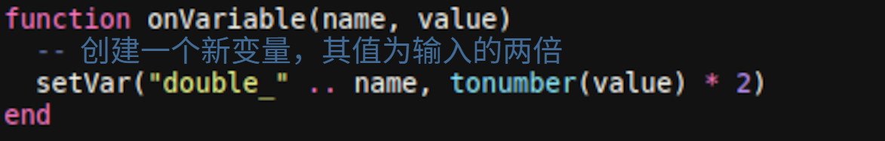

---
navigation:
  parent: crazyae2addons_index.md
  title: 数据变量
  icon: crazyae2addons:data_processor
categories:
  - Monitoring and Automation
item_ids:
  - crazyae2addons:data_processor
  - crazyae2addons:dataflow_pattern
---

# 数据变量（Lua触发器）

数据变量能对AE2网络中变量的变化做出相应反应，此能力来自存储于物品中的小型Lua脚本。监测的变量变化时，脚本会立刻执行，以此更新其他变量，或控制脚本提及的红石发信器。

---
## 前置条件
- **ME数据控制器** – 存储网络中的所有变量。
- **数据处理器** – 在变量变化时执行Lua脚本。

> 变量是**字符串**。

---
## 快速入门
1. **选择触发器**：在**数据处理器**的UI中，将**所监测变量**/**Watched variable**设置为需监测变量的名称（大小写敏感）。
2. **输入Lua脚本**：将写有脚本的物品（Lua样板）放入处理器。
3. **实现处理器**：脚本中**必须**定义：
   - `onVariable(name, value)` – 每次所监测变量变化时调用。若缺失此函数，即不会进行更新。

---
## Lua API（脚本中可用）
- `setVar(name, value)` – 设置或更新网络数据库中名为`name`的整型变量。
- `setEmitter(name, state)` – 将所提及的红石触发器打开或关闭（**on**/**off**）。
- `toggleEmitter(name)` – 反转所提及红石触发器的状态。

**注意事项**
- `name`可以是任意的字符串标签（如`"smelter"`、`"gate_A"`）。
- 脚本中变量的变化会**层级传递**：其他监测这些变量的数据处理器也会调用它们的`onVariable`。
- 除非知道自己在做什么，否则不要回写**正在监测**的变量——不然会产生循环。

---
## 示例

### 1) 阈值控制：在value > 10时驱动发信器

### 2) 在变化时切换（检测任意边沿）

### 3) 复制和处理：导出新变量

### 4) 布尔门限：将整数视作布尔值

---
## 行为与提示
- **触发时间**：`onVariable`会在所监测变量的值更新时立刻被调用（包括初始赋值）。
- **命名**：命名触发器和变量名时保持一致，使用有描述性的名称（如`reactor_enable`、`ore_count`）。
- **前后链接**：创建变量供其他处理器监测，以此搭建逻辑管线。
- **安全**：使用限制条件和卫语句来避免值迅速来回切换（如只在达到某阈值时触发）。

---
## 问题检修
- **什么都没发生** → 确保脚本中**定义**了`onVariable(name, value)`，**所监测名称**会进行严格匹配，并确保**ME数据控制器**已连接网络且有供能。
- **预期外的循环** → 可能是写入了正在监测的变量，或是在前后链接的处理器中触发了循环。
- **发信器无反应** → 检查用到的发信器`name`。检查相应的红石设备是否已连接网络，且名称一致。

---
## API参考（速查表）
- `onVariable(name, value)` – **必须存在**的入口。会在所监测变量的值更新时触发。
- `setVar(name, value)` – 向网络写入整型变量。
- `setEmitter(name, state)` – 将所提及红石发信器打开/关闭。
- `toggleEmitter(name)` – 反转所提及红石发信器的状态。
