---
navigation:
  parent: crazyae2addons_index.md
  title: Data Variables Tutorial
  icon: crazyae2addons:data_processor
categories:
  - Data Variables
item_ids:
  - crazyae2addons:logic_card
  - crazyae2addons:add_card
  - crazyae2addons:sub_card
  - crazyae2addons:mul_card
  - crazyae2addons:div_card
  - crazyae2addons:min_card
  - crazyae2addons:max_card
  - crazyae2addons:bsr_card
  - crazyae2addons:bsl_card
  - crazyae2addons:hit_card
  - crazyae2addons:hif_card
---

# Beginner's Guide to Data Variables

Welcome! This tutorial will teach you how to use Data Variables from Crazy AE2 Addons, even if you know absolutely nothing about programming.

---

## What Are Data Variables?

Data Variables are numbers that are stored inside your ME network. You can:
- Monitor them with Displays and Data Trackers.
- Update them using Data Extractors.
- Process and change them using Data Processors or Isolated Data Processors.

Think of them like invisible counters or sensors inside your network.

---

## Setting Up Your First Variable

1. **Place an ME Data Controller**
    - This block stores all your variables.
    - Make sure it is connected to your ME network and has at least one AE storage component inside (like a 1k Cell Component).

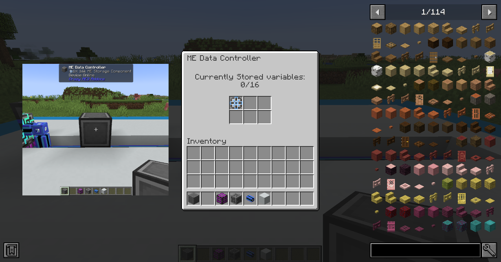

2. **Use a Data Extractor**
    - Place a Data Extractor next to a machine or tank.
    - Open its menu and click **Fetch**.
    - Choose a number you want to monitor (like energy level, progress, etc.).
    - in the right lower corner of the GUI set the delay for consecutive reads from the block (in ticks) for example 5.
    - Name it! Enter a simple name like `&FILLED` (only letters, all uppercase, no spaces, starting with `&`) and click "+".

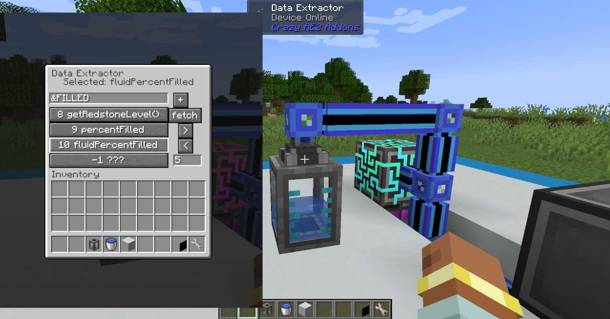

3. **Check Your Variable**
    - Open your ME Data Controller.
    - You should see your new variable stored inside!

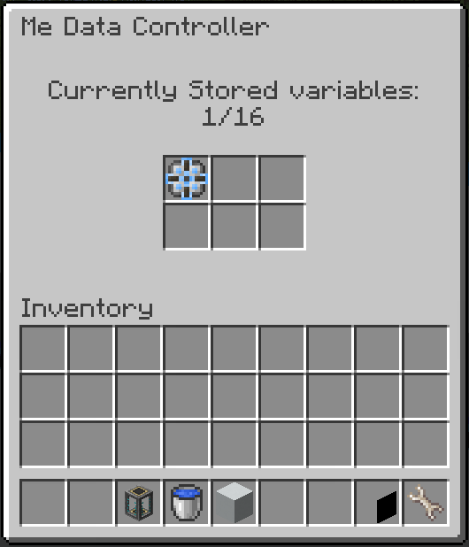

---

## Showing Variables on a Display

1. **Place a Display Part**
    - Attach it to any ME cable.

2. **Open the Display GUI**
    - Type a message like:

      `&FILLED% Filled`

    - `&FILLED` will be replaced automatically with the live number!
    - Click **Save**.

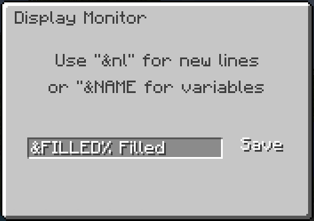

---

## Using Variables in Logic

Once you have variables, you can make your network smarter using Data Processors!

### What is a Data Processor?

A Data Processor is a block that:
- Reads variables.
- Does calculations (like addition, subtraction, multiplication, etc.).
- Writes the result back as a new variable.

It lets you "program" automatic math and decisions without typing any real code!

There are two types:
- **Data Processor** (event-driven) — it calculates only when the input changes.
- **Isolated Data Processor** (tick-driven) — it runs its program every tick automatically.

### How to Set Up a Data Processor

1. **Place a Data Processor**
    - Connect it to your ME network.

2. **Input Variable**
    - Open its GUI.
    - Enter the name of the variable you want to start with (e.g., `&FILLED`).

3. **Insert Logic Cards**
    - Add cards like Add, Sub, Mul, Div, etc.
    - Each card is one step in your "program".

4. **Configure Each Step**
    - Click the cog next to a card.
    - Choose:
        - Input 1 (variable, register, or number)
        - Input 2 (optional for math)
        - Output (where to store the result)

5. **Registers**
    - Temporary storage: `&&0`, `&&1`, `&&2`, `&&3`
    - Use them to pass results between steps.

6. **Result Variables**
    - If you set an output like `&RESULT`, it creates a new network variable with the result!
    - Remember that when you write to an external variable (not `&&0`/`&&1`/`&&2`/`&&3`), the program will stop.

---

## Example: Monitor Tank Contents

Let's say you have a fluid tank, and you want to monitor its content.

**Steps:**
- Place a Data Processor.
- Set Input Variable = `&FILLED`.
- Insert a **SUB Card** into slot 0.
- Click the cog:
    - Input 1 is already set to `&FILLED`.
    - Input 2 = 50.
    - Output = `&&0`.
    - Click save.

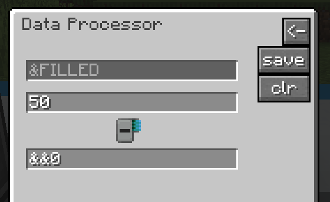

Now, when the tank is filled below 50%, the value in `&&0` will be negative (from -50 to 0), and positive otherwise (from 1 to 50).

- Insert an **HIT Card** (**H**op **I**f **T**rue) into slot 1.
- Click the cog:
    - Input 1 = `&&0` (value to check).
    - Input 2 = 3 (hop to slot number 3).
    - Output = blocked as HIT/HIF cards don't output any variable themselves.
    - Click save.

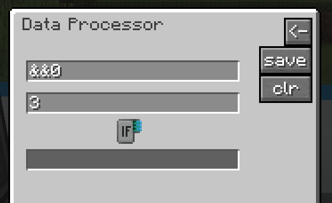

Now, when the value of `&&0` is above 0, the program will execute the card in slot number 3 as the next instruction. Otherwise, it will execute the card in slot number 2.

- Insert an **ADD Card** into slot 3 (other cards would also work).
- Click the cog:
    - Input 1 = 1.
    - Input 2 = 0.
    - Output = `&RESULT`.
    - Click save.

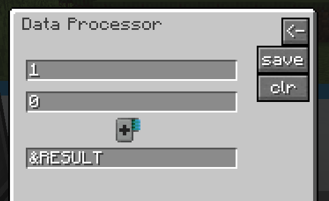

We are just writing 1 (1 + 0 = 1) to the variable `&RESULT`; the program stops there. But if the value of `&&0` is not positive, the block will execute the card in slot 2 first.

- Insert an **ADD Card** into slot 2 (other cards would also work).
- Click the cog:
    - Input 1 = 0.
    - Input 2 = 0.
    - Output = `&RESULT`.
    - Click save.

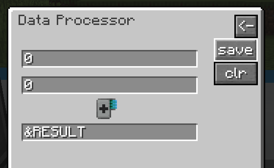

We are just writing 0 (0 + 0 = 0) to the variable `&RESULT`; the program stops there (it won't go to slot 3).

### The Program:

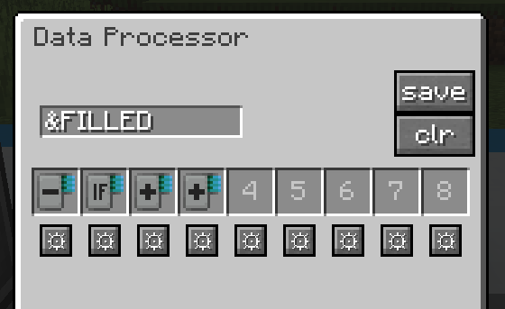

### Now You Can Display That Variable on a Display

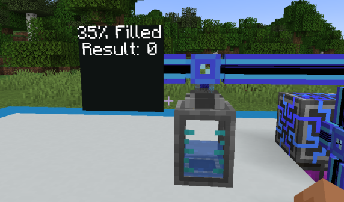
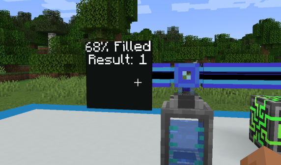

The Data Processor will update automatically whenever `&FILLED` changes.

### Let's Add Redstone to the System

1. Place a Data Tracker and, for example, a redstone lamp beside it.
2. Configure it to track our `&RESULT`.
3. Change the amount of fluid in your tank and watch what happens.

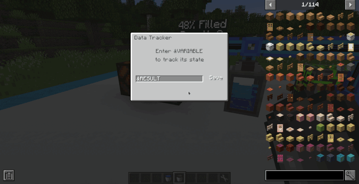

---

## Logic Cards

#### ADD
Output = Input 1 + Input 2

#### SUB
Output = Input 1 - Input 2

#### MAX
If Input 1 &gt; Input 2 then Output = Input 1 else Output = Input 2

#### MIN
If Input 1 &lt; Input 2 then Output = Input 1 else Output = Input 2

#### MUL
Output = Input 1 * Input 2

#### DIV
Output = Input 1 / Input 2

#### BSR
Output = Input 1 &gt;&gt; Input 2

#### BSL
Output = Input 1 &lt;&lt; Input 2

#### HIT
If Input 1 &gt; 0 then hop to the slot with the number of Input 2

#### HIF
If Input 1 &lt;= 0 then hop to the slot with the number of Input 2

---

## Isolated Data Processor

- It is always initialized with 0 as input.
- Executes 1 logic card per tick.
- The program stops when it encounters an empty slot.
- Can write a variable multiple times to the system, BUT if you try to write two different variables, the new one will overwrite the old. For example, if you set a variable `&FOO` first and then try to set a variable `&BAR`, after the second write, `&FOO` will be deleted.
- Try and experiment with it; you are smart, you will figure it out.

---

## Final Tips

- Displays and Trackers update instantly when a variable changes.
- Don’t be afraid to experiment - errors *probably* won’t crash your game!

## Congratulations - you now know how to create a smart ME network using Data Variables!