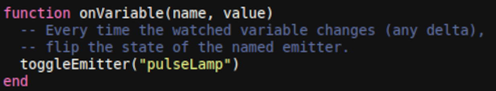
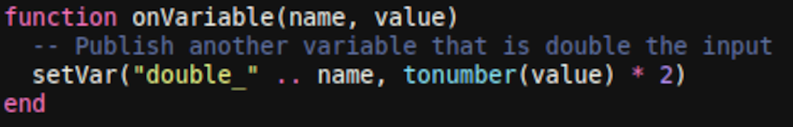

---
navigation:
  parent: crazyae2addons_index.md
  title: Data Variables
  icon: crazyae2addons:data_processor
categories:
  - Monitoring and Automation
item_ids:
  - crazyae2addons:data_processor
  - crazyae2addons:dataflow_pattern
---

# Data Variables (Lua Triggers)

Data Variables let you react to changes in your AE2 network variables using small Lua scripts stored in an item. When the watched variable changes, your script is executed instantly, letting you update other variables or control named redstone emitters.

---
## Prerequisites
- **ME Data Controller Block** – stores all variables in the network.
- **Data Processor** – runs your Lua script when the watched variable changes.

> Variables are **strings**.

---
## Quick Start
1. **Choose the trigger**: In the **Data Processor** UI, set the **Watched variable** to the exact name of the variable you want to subscribe to (case-sensitive).
2. **Provide a Lua script**: Put the scripted item (Lua Pattern) into the processor.
3. **Implement the handler**: Your script **must** define:
   - `onVariable(name, value)` – called every time the watched variable’s value changes. If this function is missing, nothing will happen.

---
## Lua API (available in scripts)
- `setVar(name, value)` – Set or update the integer variable `name` in the network’s database.
- `setEmitter(name, state)` – Turn a named redstone emitter **on**/**off**.
- `toggleEmitter(name)` – Flip the current state of a named redstone emitter.

**Notes**
- `name` is an arbitrary string label you choose (e.g., `"smelter"`, `"gate_A"`).
- Changing variables in your script can **cascade**: any other Data Processors watching those variables will also fire their own `onVariable`.
- Avoid writing back to the **same** variable you are watching unless you know what you’re doing—this can create loops.

---
## Examples

### 1) Threshold control: drive an emitter when value > 10

### 2) Toggle on any change (edge-agnostic)

### 3) Mirror & transform: derive a new variable

### 4) Boolean gate: treat integers as booleans

---
## Behavior & Tips
- **Trigger timing**: `onVariable` is invoked immediately when the watched variable gets new value (including first assignment).
- **Naming**: Keep emitter and variable names consistent and descriptive (e.g., `reactor_enable`, `ore_count`).
- **Chaining**: Build logic pipelines by setting variables that other processors watch.
- **Safety**: Throttle or guard conditions to prevent rapid flapping (e.g., only toggle when crossing thresholds).

---
## Troubleshooting
- **Nothing happens** → Ensure your script **defines** `onVariable(name, value)`, the **watched name** matches exactly, and the **ME Data Controller** is installed and powered.
- **Unexpected loops** → You may be writing to the same variable you’re watching, or triggering a cycle through chained processors.
- **Emitters don’t react** → Check the emitter `name` you are addressing and verify the corresponding redstone device is connected and named identically.

---
## API Reference (cheat sheet)
- `onVariable(name, value)` – **Required** entrypoint. Triggered on any new value of the watched variable.
- `setVar(name, value)` – Write integer variable to the network.
- `setEmitter(name, state)` – Set named redstone emitter to ON/OFF.
- `toggleEmitter(name)` – Invert named redstone emitter state.
