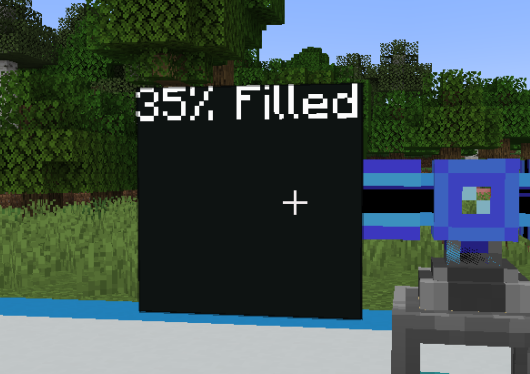

---
navigation:
  parent: crazyae2addons_index.md
  title: Display Monitor
  icon: crazyae2addons:display_monitor
categories:
  - Monitoring and Automation
item_ids:
  - crazyae2addons:display_monitor
---

# Display Monitor — User Guide

## Short Reference
* &cRRGGBB — text color
* &bRRGGBB — background color
* &i^namespace:id — inline icon (item/block/fluid)
* &s^namespace:id — ME stock amount
* &s^namespace:id%N — ME stock scaled by 10 to the power of N (rounded)
* &d^namespace:id@WINDOW — rate over WINDOW, scaled to per 1 second
* &d^namespace:id%PER@WINDOW — rate over WINDOW, scaled to PER
* &( ... ) — math expression evaluation for example &( 2 + 2 )
* some other Markdown tokens also work

This guide explains how to configure, format text, and build multi-block walls with the Display Monitor part in CrazyAE2Addons.

## [Video Tutorial](https://youtu.be/49oCeCdQrXg&list=PLB8Rr5Xojkr5T1qoPr_4JdETiBkF4qF6r)

---

## What it is

The Display Monitor is a flat AE2 part you place on a cable face. When powered, 
it renders text (with simple formatting, colors, and inline icons) and can show live ME stock values and deltas.

Power: idle draw is minimal (about 1 AE/t). The monitor must be powered and active on your AE network to render.

---

## Quick Start

1. Place the Display Monitor on the desired cable face.
2. Right-click it to open the Display menu.
3. In the text box, type your message. Example:

System Online
\* &i^minecraft:iron_ingot stock: &s^minecraft:iron_ingot
\*  &i^minecraft:iron_ingot /s: &d^minecraft:iron_ingot%1s@1m

4. Apply/Save. If the monitor is powered, the text appears.

---

## New lines

You can use either real new lines (Enter) or the token &nl.

---

## Text formatting

### Inline styles (markdown-like)

* **bold** using \*\*double asterisks\*\*
* *italic* using single \*asterisks\*
* __underline__ using double \_\_underscores\_\_
* ~~strikethrough~~ using double \~\~tildes\~\~

### Headings

Lines starting with one or more # become headings and render larger:

* \# Heading 1
* \#\# Heading 2
* \#\#\# Heading 3

### Bullets and indentation

* Start a line with "* " or "- " to get a bullet (•)
* Begin a line with one or more ">>" to add visible indentation markers

---

## Colors

* Text color: &cRRGGBB (hex), affects following text until changed again.
  * Example: &cFF0000 makes following text red.
* Background color: &bRRGGBB (hex), sets the whole panel background (opaque).
  * Background is global per linked wall (set it once anywhere in the text).

Example:

&b002020Status: &cF000E0\*\*ONLINE\*\*

---

## Inline icons

You can render item, block, or fluid icons inline using:

&i^namespace:id

Examples:

* &i^minecraft:diamond
* &i^minecraft:oak_log
* &i^minecraft:water

If the id cannot be resolved, the token stays as text.

---

## ME Stock tokens (auto-count from Storage)

You can display current amounts in your ME storage with:

&s^namespace:id
&s^namespace:id%N

* &s^minecraft:oak_log shows the exact amount.
* Optional %N scales the number by 10 to the power of N with rounding.

Examples (if ME has 64):

* &s^minecraft:oak_log -> 64
* &s^minecraft:oak_log%1 -> 6
* &s^minecraft:oak_log%2 -> 1 (rounding)
 
---

## Delta / rate tokens (change over time)

You can show a rate of change using:

&d^namespace:id@WINDOW
&d^namespace:id%PER@WINDOW

Units:

* t = ticks
* s = seconds
* m = minutes

Meaning:

* WINDOW decides how far back the monitor looks when computing the change.
* PER decides what unit the value is scaled to (per second, per minute, etc.). If omitted, it defaults to per 1 second.

Examples:

* &d^minecraft:iron_ingot@10s
  Shows the average change rate over the last 10 seconds, scaled to per 1 second.
* &d^minecraft:iron_ingot%1m@5m
  Shows the average change rate over the last 5 minutes, scaled to per 1 minute.
* &d^minecraft:water@30s
  Works for fluids too (by id).

Notes:

* The window is clamped to at least 1 second and at most 30 minutes.
* Output is signed: positive shows +, negative shows -.

---

## Math expressions

You can evaluate math expressions using:

&( expression )

The monitor evaluates these after tokens are resolved, so you can do things like:

Stored stacks (rounded): &(&s^minecraft:iron_ingot / 64)

If parsing fails, the result becomes ERR.

---

## Multi-Monitor Walls (Linked Mode)

You can stitch several monitors into a single large display on a wall (N/E/S/W facing).

### Requirements

All monitors must:

* Be on the same wall face (same side/facing).
* Be powered and active.
* Have Linked Mode enabled (toggle in each monitor’s menu (default on)).
* Form a perfect rectangle (no gaps).

Ceiling/floor monitors (UP/DOWN) do not link into walls; they render as single tiles.

### How rendering works

Only one monitor in the rectangle actually draws the text; the rest provide surface area.

The renderer uses the top-left tile of the rectangle (from the wall’s perspective) as the origin tile. Put your text on that one monitor to render across the whole wall.

### Building steps

1. Place your monitors in a perfect rectangle on a wall.
2. Power the cable(s) behind them.
3. Enable Linked Mode on each.
4. Open the top-left monitor and configure the text.

---

## Placement & rotation

* On walls (N/E/S/W): the text follows the wall orientation.
* On floor/ceiling (UP/DOWN): the monitor stores a spin captured from your facing at placement. To change it, break and place again while facing a different direction.

---

## Tips & Troubleshooting

* No text shows: ensure the monitor is powered and active; for linked walls, edit the top-left tile.
* Wall not linking: check Linked Mode is enabled on every tile.

---
