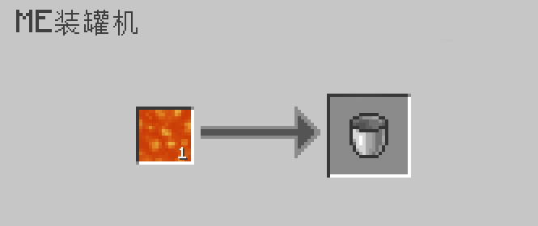
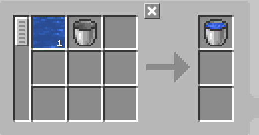

---
navigation:
    parent: epp_intro/epp_intro-index.md
    title: ME装罐机
    icon: expatternprovider:caner
categories:
- extended devices
item_ids:
- expatternprovider:caner
---

# ME装罐机

<BlockImage id="expatternprovider:caner" scale="8"></BlockImage>

ME装罐机是一个“灌装”材料的机器，包括液体、Mekanism气体、能量甚至植物魔法的魔力！ 

第一个槽放置需要被填充的物品，第二个槽放置用来容纳它的容器；排空模式则反之。

它需要能量来运行，每次操作花费80AE。

默认情况下，它只能填充液体，你需要安装相应的附属，才能使其填充其它材料。

### 支持的附属：
- Applied Flux
- 应用能源：通用机械附属
- 应用能源：植物魔法附属

## 使用ME装罐机自动合成

只有顶部和底部才能输入能量并连接到网络。

<GameScene zoom="6" background="transparent">
  <ImportStructure src="../structure/caner_example.snbt"></ImportStructure>
</GameScene>

对于ME装罐机有一个简便的处理方法：ME装罐机将自动弹出由<ItemLink id="ae2:pattern_provider" />输入的物品。

<GameScene zoom="6" background="transparent">
  <ImportStructure src="../structure/caner_auto.snbt"></ImportStructure>
</GameScene>

该模式的样板必须只包含要填充的材料和要填充的容器。
以下是一些例子:

装满水桶：

充满能量板（需要“应用能源：通用机械附属”）：

## 排空模式

ME装罐机可以在排空模式下从容器中抽出材料。相应样板中的输入输出也需更改。
