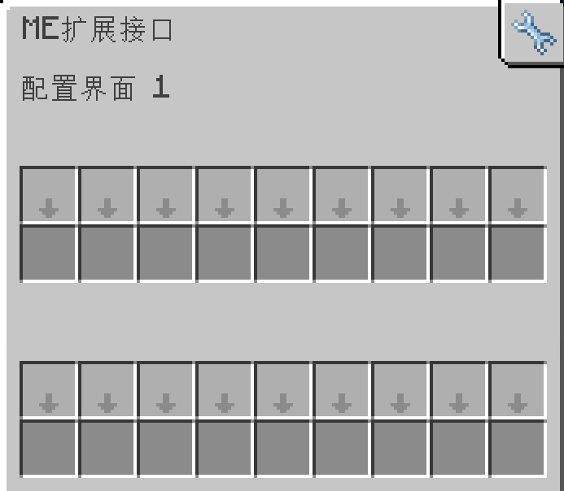

---
navigation:
    parent: epp_intro/epp_intro-index.md
    title: ME扩展接口
    icon: expatternprovider:ex_interface
categories:
- extended devices
item_ids:
- expatternprovider:ex_interface
- expatternprovider:ex_interface_part
---

# ME扩展接口

<Row gap="20">
<BlockImage id="expatternprovider:ex_interface" scale="8"></BlockImage>
<GameScene zoom="8" background="transparent">
  <ImportStructure src="../structure/cable_ex_interface.snbt"></ImportStructure>
</GameScene>
</Row>

ME扩展接口是一个具有更多配置槽位的<ItemLink id="ae2:interface" />。

*“我真的需要这个吗？”*

