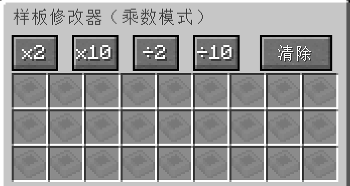
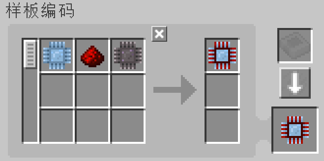
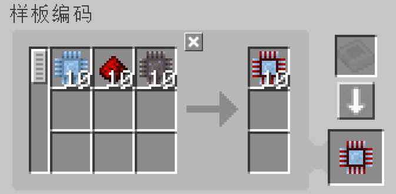
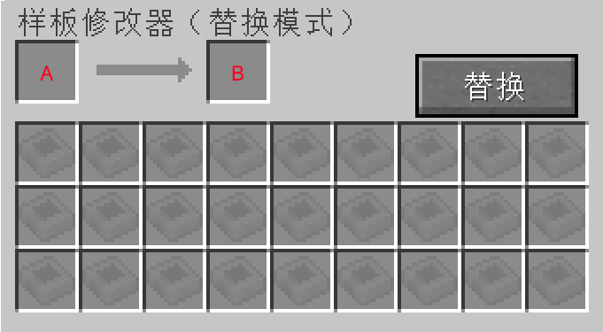
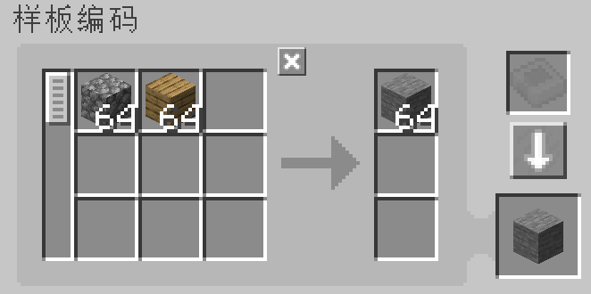
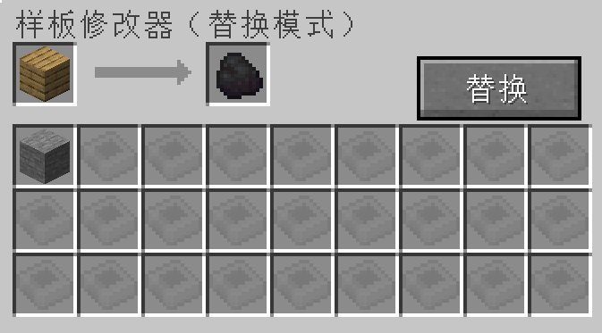
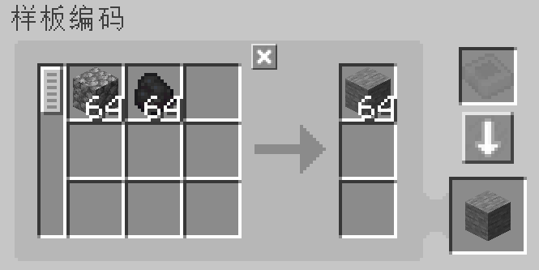
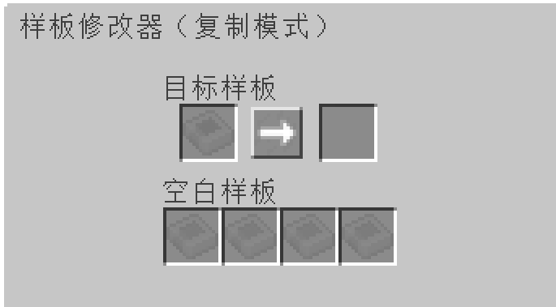

---
navigation:
    parent: epp_intro/epp_intro-index.md
    title: 样板修改器
    icon: expatternprovider:pattern_modifier
categories:
- extended items
item_ids:
- expatternprovider:pattern_modifier
---

# 样板修改器

样板修改器是一个用于批量修改样板的工具。

<ItemImage id="expatternprovider:pattern_modifier" scale="4"></ItemImage>

右键单击它以打开它的GUI。

## 乘法模式

通过点击对应的按钮，可以将合成样板的输入和输出的物品数量乘以/除以某个值。

原样板：

x10以后：

它还可以快速清除所有样板的内容，单击“清除”按钮以将它们变成空白样板。

### 注意事项:

- 除法按钮仅在物品数量可整除时起作用。例如，当前样板需要3圆石作为输入时，÷2按钮将不起作用，因为3÷2是1.5。

- 乘法按钮有一个上限(999999)。它不能使单一物品的数量超过这个数。

## 替换模式

用其他物品替换样板的某些输入/输出的物品。

槽A是要替换的物品，槽B是要被替换的物品。

例如，以下设置将使用煤炭替换木板。

单击“替换”按钮执行替换。

## 复制模式

在这种模式下，你可以复制任何已设定的样板。

