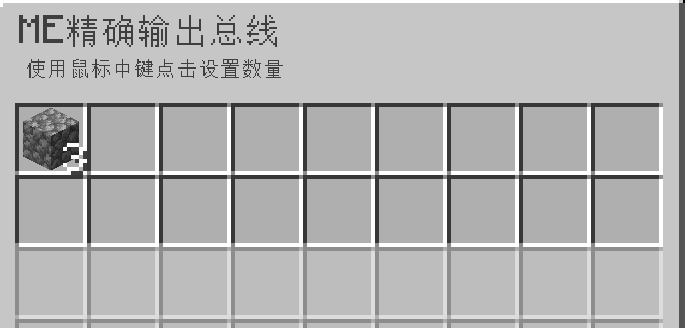
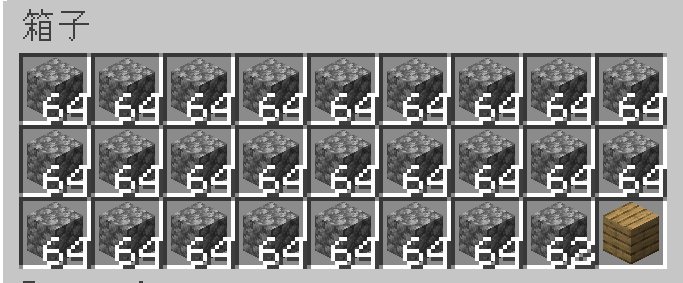

---
navigation:
    parent: epp_intro/epp_intro-index.md
    title: ME精确输出总线
    icon: expatternprovider:precise_export_bus
categories:
- extended devices
item_ids:
- expatternprovider:precise_export_bus
---

# ME精确输出总线

<GameScene zoom="8" background="transparent">
  <ImportStructure src="../structure/cable_precise_export_bus.snbt"></ImportStructure>
</GameScene>

ME精确输出总线会输出指定数量的物品/液体。只有当容器可以完整地接受一份的输出并且网络中存在完整的一份物品时，它才会输出。

## 示例

这意味着每次操作输出3个圆石。当网络中圆石数量低于3时，它将停止输出。

当目标容器无法容纳所有输出的内容时，它也会停止输出。
箱子现在只能再装2个圆石了，所以停止输出了。
