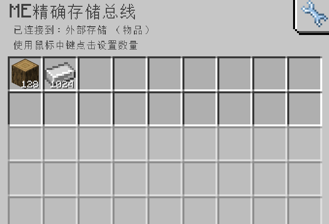

---
navigation:
    parent: epp_intro/epp_intro-index.md
    title: ME 精准存储总线
    icon: expatternprovider:precise_storage_bus
categories:
- extended devices
item_ids:
- expatternprovider:precise_storage_bus
---

# ME 精准存储总线

<GameScene zoom="8" background="transparent">
  <ImportStructure src="../structure/cable_precise_storage_bus.snbt"></ImportStructure>
</GameScene>

ME 精准存储总线的性质与<ItemLink id="ae2:storage_bus" />相同，但你可以通过设置物品数量来精确输入，当容器内的物品超过设置的值，将会停止输入（输出不受此影响）。

