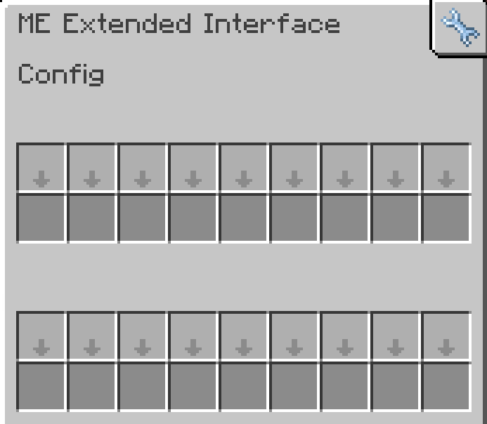

---
navigation:
    parent: epp_intro/epp_intro-index.md
    title: ME Extended Interface
    icon: expatternprovider:ex_interface
categories:
- extended devices
item_ids:
- expatternprovider:ex_interface
- expatternprovider:ex_interface_part
---

# ME Extended Interface

<Row gap="20">
<BlockImage id="expatternprovider:ex_interface" scale="8"></BlockImage>
<GameScene zoom="8" background="transparent">
  <ImportStructure src="../structure/cable_ex_interface.snbt"></ImportStructure>
</GameScene>
</Row>

ME Extended Interface is a <ItemLink id="ae2:interface" /> with a larger config inventory.

*Am I actually need this?*

