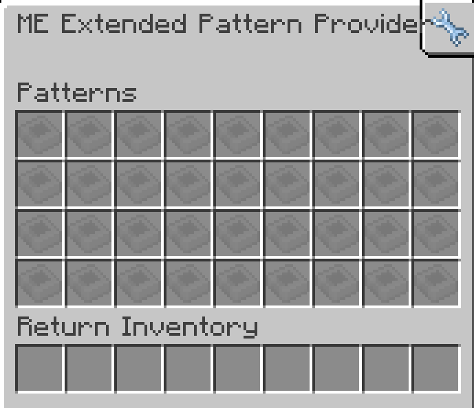

---
navigation:
    parent: epp_intro/epp_intro-index.md
    title: ME Extended Pattern Provider
    icon: extendedae:ex_pattern_provider
categories:
- extended devices
item_ids:
- extendedae:ex_pattern_provider
- extendedae:ex_pattern_provider_part
---

# ME Extended Pattern Provider

<Row gap="20">
<BlockImage id="extendedae:ex_pattern_provider" scale="8"></BlockImage>
<BlockImage id="extendedae:ex_pattern_provider" p:push_direction="up" scale="8"></BlockImage>
<GameScene zoom="8" background="transparent">
  <ImportStructure src="../structure/cable_ex_pattern_provider.snbt"></ImportStructure>
</GameScene>
</Row>

ME Extended Pattern Provider is a <ItemLink id="ae2:pattern_provider" /> with a larger 
pattern inventory.

*Who need subnet when you can put all patterns in one block.*

