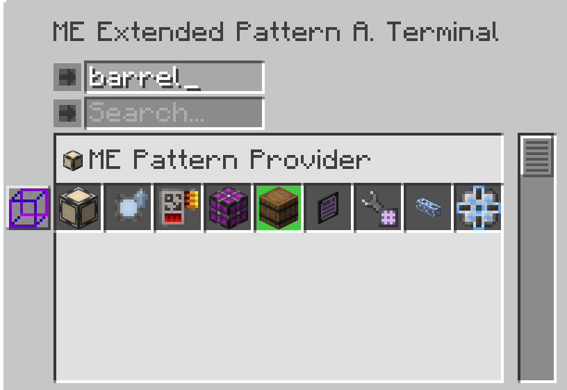
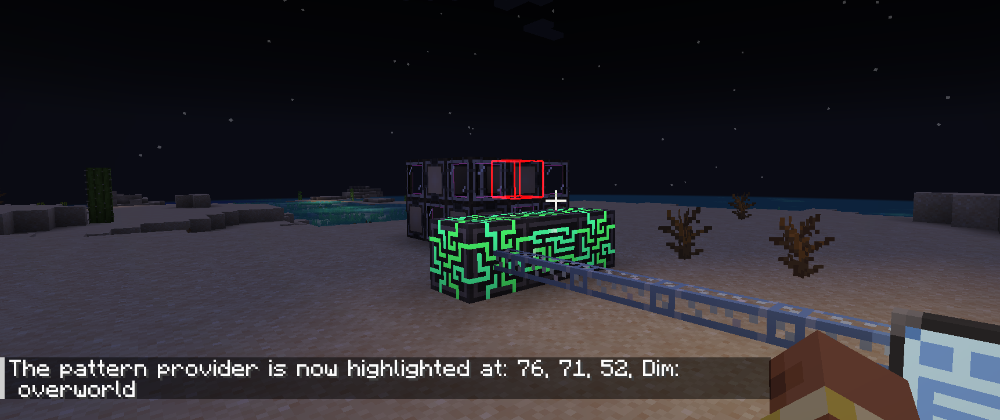

---
navigation:
    parent: epp_intro/epp_intro-index.md
    title: ME Extended Pattern Access Terminal
    icon: extendedae:ex_pattern_access_part
categories:
- extended devices
item_ids:
- extendedae:ex_pattern_access_part
- extendedae:wireless_ex_pat
---

# ME Extended Pattern Access Terminal

ME Extended Pattern Access Terminal provides 3 extra additional features compared with <ItemLink id="ae2:pattern_access_terminal" />.

<Row gap="20">
<GameScene zoom="6" background="transparent">
<ImportStructure src="../structure/cable_ex_pattern_terminal.snbt"></ImportStructure>
<IsometricCamera yaw="180"></IsometricCamera>
</GameScene>
<ItemImage id="extendedae:wireless_ex_pat" scale="4"></ItemImage>
</Row>

## Better Pattern Search

You can search pattern by input/output ingredients' name.

## Pattern Highlight

Sometimes it is still hard to find the desired pattern because patterns are always displayed as a group. Now the Extended
Pattern Access Terminal can highlight the matched pattern in GUI.

## Pattern Provider In-World Highlight

It's annoying to find out which Pattern Provider is stuck when doing large crafting jobs. Extended Pattern Access Terminal
can highlight the Pattern Provider in world, so you can locate it easily.

