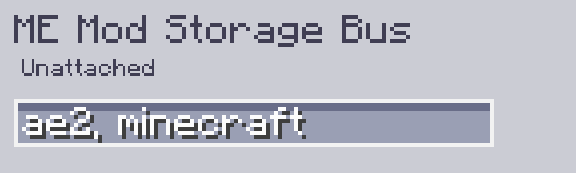

---
navigation:
    parent: epp_intro/epp_intro-index.md
    title: ME Mod Storage Bus
    icon: extendedae:mod_storage_bus
categories:
- extended devices
item_ids:
- extendedae:mod_storage_bus
---

# ME Mod Storage Bus

<GameScene zoom="8" background="transparent">
  <ImportStructure src="../structure/cable_mod_storage_bus.snbt"></ImportStructure>
</GameScene>

ME Mod Storage Bus is a <ItemLink id="ae2:storage_bus" /> that can be filtered by mod name or mod id.

Use comma to separate multiple mod ids in case you want to filter multiple mods.

