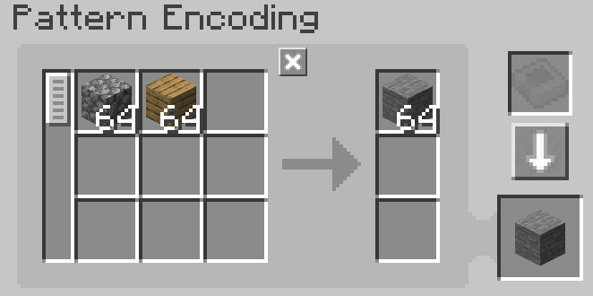
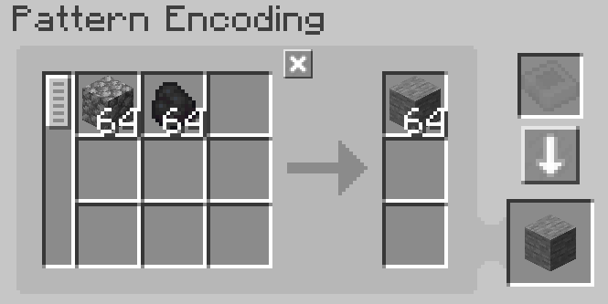
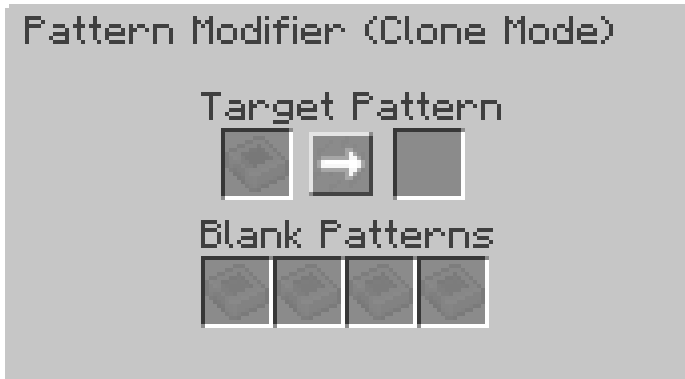

---
navigation:
    parent: epp_intro/epp_intro-index.md
    title: Pattern Modifier
    icon: extendedae:pattern_modifier
categories:
- extended items
item_ids:
- extendedae:pattern_modifier
---

# Pattern Modifier

Pattern Modifier is a tool for bulk pattern modification.

<ItemImage id="extendedae:pattern_modifier" scale="4"></ItemImage>

Right click it to open its GUI.

## Multiply Mode

You can multiply/divide processing pattern's input and output amount by x by clicking the corresponding button. 

Origin Pattern:

After x10:

It also can clear all patterns contents and turn them into blank patterns by clicking the Clear button.

### Notes:

 - The division button only works when its amount is divisible. For example ÷2 button won't work when pattern requires 3x
cobblestones as input, because 3÷2 is 1.5.

 - The multiplication button has a cap(999999). It can't make single ingredient's amount over this number.

## Replace Mode

Replace pattern's certain input and output ingredient with the other item.

The slot A is what will be replaced and slot B is what the target will be replaced with.

For example, the following setting will replace the plank with coal.

Click the Replace button to perform the replacement.

## Clone Mode

You make copy any give pattern in this mode.

