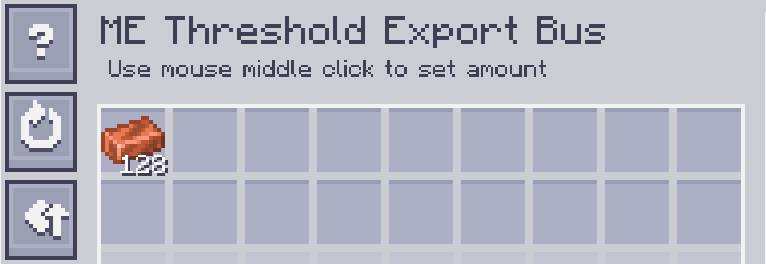
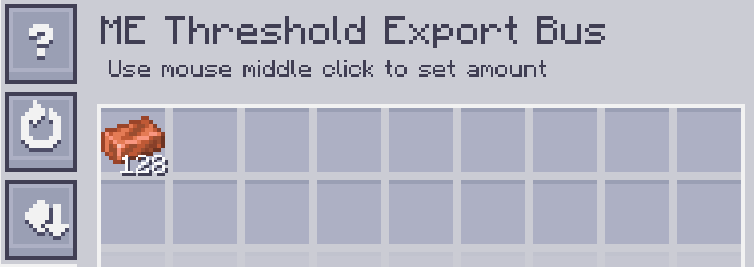

---
navigation:
    parent: epp_intro/epp_intro-index.md
    title: ME Threshold Export Bus
    icon: extendedae:threshold_export_bus
categories:
- extended devices
item_ids:
- extendedae:threshold_export_bus
---

# ME Threshold Export Bus

<GameScene zoom="8" background="transparent">
  <ImportStructure src="../structure/cable_threshold_export_bus.snbt"></ImportStructure>
</GameScene>

ME Threshold Export Bus works when the quantity of an item that stored in ME network is above/below the threshold.

## Example

The threshold of copper is set to 128, so it exports copper when the stored copper in network is over 128.

The threshold is same as above, but the mode is set to BELOW. it exports copper when the stored copper is below 128.
