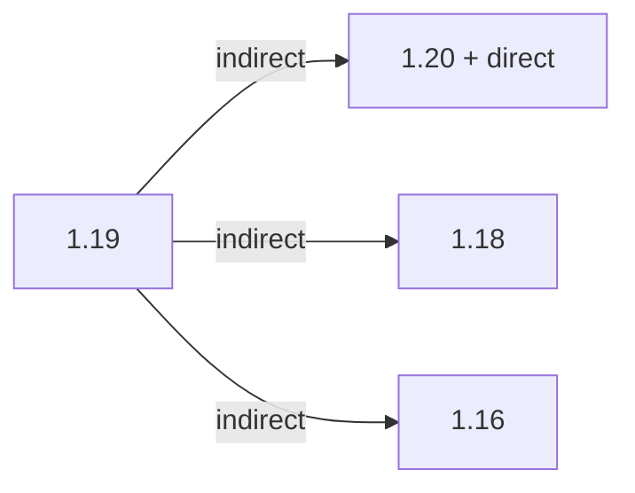

# 引用结构

以 [1.19](/projects/1.19/assets/scaling-health/scalinghealth) 为基准。

1.20 修改了 `command.scalinghealth.playerName` 的占位符 `%s` 数量，以 direct 形式修复。

部分更新在 1.19 作出，由 indirect 反向更新到更低版本。出于保留历史记录的必要，未删除相应版本的 zh_cn.json。

# 已知问题

游戏中击杀 Blight 变种（有紫色火焰效果）的敌对生物使会给所有玩家发送消息，但该消息的生成[代码](https://github.com/SilentChaos512/ScalingHealth/blob/1.20/src/main/java/net/silentchaos512/scalinghealth/event/BlightHandler.java)存在问题，导致产生类似“%1$s被$%2$s杀死了 *玩家名*”（其中*玩家名*是击杀者）的消息。

该问题无法通过我们解决。

# 链接区域

[1.19](/projects/1.19/assets/scaling-health/scalinghealth)  
[1.18](/projects/1.18/assets/scaling-health/scalinghealth)  
[1.16](/projects/1.16/assets/scaling-health/scalinghealth)
 