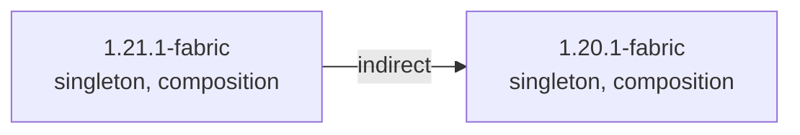

### 总概



```
1.21.1-fabric (singleton)(composition)
 └── 1.20.1-fabric (singleton)(composition)
```

### 传送区域

- [1.20.1-fabric](/projects/1.20-fabric/assets/excessive-building/excessive_building)
- [1.21.1-fabric](/projects/1.21-fabric/assets/excessive-building/excessive_building)