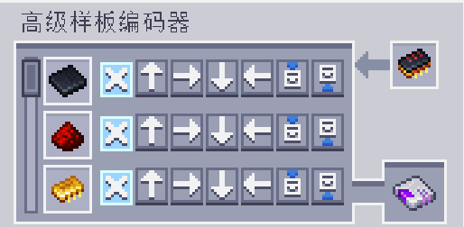

---
navigation:
  parent: aae_intro/aae_intro-index.md
  title: 高级样板编码器
  icon: advanced_ae:adv_pattern_encoder
categories:
  - advanced items
item_ids:
  - advanced_ae:adv_pattern_encoder
  - advanced_ae:adv_processing_pattern
---

# 高级样板编码器

为指导ME高级样板供应器具体的面设置，还需一个特殊设备将这些信息编码存储。手持右击可打开其界面。

<ItemImage id="advanced_ae:adv_pattern_encoder" scale="4"></ItemImage>

已编码的处理样板可放入左侧槽位，编码器会解码其中材料并以列表一一显示。

界面每行各有一组按钮，分别代表材料可以输出到的目标面。选中“A”按钮即会送至与样板供应器相贴合的面，选中其他按钮则会输出到对应面。需格外注意，高级样板只可由<ItemLink id="advanced_ae:adv_pattern_provider" />无损解码，在其他样板供应器中的表现和普通的样板没有区别。此外，若有物品无法送入指定面，则所有物品都不进行面敏感输入，而只采用标准的样板供应器行为。