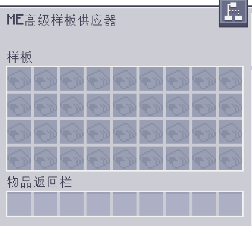

---
navigation:
  parent: aae_intro/aae_intro-index.md
  title: ME高级样板供应器
  icon: advanced_ae:adv_pattern_provider
categories:
  - advanced devices
item_ids:
  - advanced_ae:adv_pattern_provider
  - advanced_ae:small_adv_pattern_provider
  - advanced_ae:adv_pattern_provider_part
  - advanced_ae:small_adv_pattern_provider_part
---

# ME高级样板供应器

<Row gap="20">
<BlockImage id="advanced_ae:adv_pattern_provider" scale="8"></BlockImage>
<BlockImage id="advanced_ae:adv_pattern_provider" p:push_direction="up" scale="8"></BlockImage>
<GameScene zoom="8" background="transparent">
  <ImportStructure src="../structure/cable_app_part.snbt"></ImportStructure>
</GameScene>
</Row>

ME高级样板供应器是<ItemLink id="ae2:pattern_provider" />的全新变种，在标准的供应器和<ItemLink id="extendedae:ex_pattern_provider" />之上加入了样板中物品输入面的设置。如今，自动化那些需在特定面输入特定物品的机器不再要管道了，这一个方块就已足够！

*说你呢，通用机械（Mekanism）。*

而为使用此特性，需先将经过编码的样板放入<ItemLink id="advanced_ae:adv_pattern_encoder" />处理为高级版本——<ItemLink id="advanced_ae:adv_processing_pattern" />，再将其插入此供应器。
