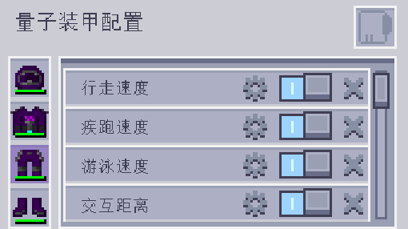

---
navigation:
  parent: aae_intro/aae_intro-index.md
  title: 量子装甲
  icon: advanced_ae:quantum_helmet
categories:
  - advanced items
item_ids:
  - advanced_ae:quantum_helmet
  - advanced_ae:quantum_chestplate
  - advanced_ae:quantum_leggings
  - advanced_ae:quantum_boots
  - advanced_ae:quantum_upgrade_base
  - advanced_ae:walk_speed_card
  - advanced_ae:sprint_speed_card
  - advanced_ae:step_assist_card
  - advanced_ae:jump_height_card
  - advanced_ae:lava_immunity_card
  - advanced_ae:flight_card
  - advanced_ae:water_breathing_card
  - advanced_ae:auto_feeding_card
  - advanced_ae:auto_stock_card
  - advanced_ae:magnet_card
  - advanced_ae:hp_buffer_card
  - advanced_ae:evasion_card
  - advanced_ae:regeneration_card
  - advanced_ae:strength_card
  - advanced_ae:attack_speed_card
  - advanced_ae:luck_card
  - advanced_ae:reach_card
  - advanced_ae:swim_speed_card
  - advanced_ae:night_vision_card
  - advanced_ae:flight_drift_card
  - advanced_ae:recharging_card
  - advanced_ae:portable_workbench_card
  - advanced_ae:pick_craft_card
---

# 量子装甲

<Row gap="10">
<ItemImage id="advanced_ae:quantum_helmet" scale="4"></ItemImage>
<ItemImage id="advanced_ae:quantum_chestplate" scale="4"></ItemImage>
<ItemImage id="advanced_ae:quantum_leggings" scale="4"></ItemImage>
<ItemImage id="advanced_ae:quantum_boots" scale="4"></ItemImage>
</Row>

* <ItemLink id="advanced_ae:quantum_helmet" />
* <ItemLink id="advanced_ae:quantum_chestplate" />
* <ItemLink id="advanced_ae:quantum_leggings" />
* <ItemLink id="advanced_ae:quantum_boots" />

你可曾想过把AE系统穿在身上？很好，现在就让你的幻想成真。量子装甲是高科技的神奇盔甲，能与AE2系统相连，让你随时随地访问网络！默认情况下，它由能量驱动，防御能力可与下界合金盔甲媲美。它可用能量缓存制造能量盾，足以吸收大量伤害。量子靴子还能抵消摔落伤害，而胸甲则可免去飞行时的挖掘速度惩罚。不过，它的真正力量还需升级来解锁！

 

## 连接盔甲

盔甲的各部件可独立连接至ME系统，放入<ItemLink id="ae2:wireless_access_point" />中的对应槽位即可。各升级各部件解锁的增益互不相同。详情在后文介绍。注意，这些额外功能只会在所连访问点的范围内生效。

 

## 安装升级

穿戴盔甲后按下键位（默认为N）打开量子装甲配置界面，即可安装升级。

此界面可供添加和移除升级，也可启用和禁用它们，还可调整升级的配置。

 

## 量子升级基础卡

<ItemImage id="advanced_ae:quantum_upgrade_base" scale="2"></ItemImage>

<ItemLink id="advanced_ae:quantum_upgrade_base" />自身没有太大用处，但它是合成所有升级卡的原材料。

 

## 自动喂食卡

<ItemImage id="advanced_ae:auto_feeding_card" scale="2"></ItemImage>

<ItemLink id="advanced_ae:auto_feeding_card" />能用特定种类的物品喂食玩家。将选定的物品拖至过滤栏后，若盔甲已与AE2网络相连，则只要玩家感到饥饿，它就会在网络中寻找对应的物品喂食玩家。

 

## 自动补货卡

<ItemImage id="advanced_ae:auto_stock_card" scale="2"></ItemImage>

<ItemLink id="advanced_ae:auto_stock_card" />同样需要所在盔甲与AE2网络建立连接，且处于访问点范围之内。它能将玩家物品栏中的少数几种物品维持在一定的数量。这些配置槽不只能存下一组物品，如果真有需求，可以让它维持多于一组的物品。

 

## 各类速度卡

<Row gap="10">
<ItemImage id="advanced_ae:walk_speed_card" scale="2"></ItemImage>
<ItemImage id="advanced_ae:sprint_speed_card" scale="2"></ItemImage>
<ItemImage id="advanced_ae:swim_speed_card" scale="2"></ItemImage>
</Row>

* <ItemLink id="advanced_ae:walk_speed_card" />
* <ItemLink id="advanced_ae:sprint_speed_card" />
* <ItemLink id="advanced_ae:swim_speed_card" />

这些升级卡能提升穿戴者的移动速度，具体多快均可配置，也会修改潜行和飞行时的移动能力。需注意，如果已经有了其他加快速度的效果，可将这些升级改为减慢速度，方便控制。

 

## 跳高卡

<Row gap="10">
<ItemImage id="advanced_ae:jump_height_card" scale="2"></ItemImage>
<ItemImage id="advanced_ae:step_assist_card" scale="2"></ItemImage>
</Row>

* <ItemLink id="advanced_ae:jump_height_card" />
* <ItemLink id="advanced_ae:step_assist_card" />

这些升级会影响垂直方向的移动能力，可借此跳得更高或是提高步伐高度。

 

## 各类飞行卡

<Row gap="10">
<ItemImage id="advanced_ae:flight_card" scale="2"></ItemImage>
<ItemImage id="advanced_ae:flight_drift_card" scale="2"></ItemImage>
</Row>

### 飞行卡

安装<ItemLink id="advanced_ae:flight_card" />后即启用创造模式飞行。界面中的滑动条可配置飞行速度。会与行走/疾跑的速度升级叠加。

### 飞行惯性卡

<ItemLink id="advanced_ae:flight_drift_card" />只在装入飞行卡后起效，这张卡还会加入一个滑动条，以调整创造模式飞行中的惯性。低值即迅速停止，设为0时停止运动即立即停止移动和滑动。

 

## ME无线充能卡

<ItemImage id="advanced_ae:recharging_card" scale="2"></ItemImage>

<ItemLink id="advanced_ae:recharging_card" />可为所装入的盔甲部件无线充能。需与AE2网络相连且身处访问点范围内。装入胸甲后，这种卡还可物品栏中的物品充能。

 

## 便携式元件工作台卡

<ItemImage id="advanced_ae:portable_workbench_card" scale="2"></ItemImage>

<ItemLink id="advanced_ae:portable_workbench_card" />为量子盔甲准备了一个便携式元件工作台。打开需按下对应键位。它的实际功效和真正的元件工作台没有差别。

 

## 点选合成卡

<ItemImage id="advanced_ae:pick_craft_card" scale="2"></ItemImage>

<ItemLink id="advanced_ae:pick_craft_card" />为盔甲加入了一个新键位，按下即可让ME网络开始尝试合成玩家所看的方块。盔甲需与AE2网络相连且身处访问点范围内。符合条件时会弹出界面，要求输入合成数量，后续步骤与普通的自动合成请求完全一致。

 

## 各类实用卡

<Row gap="10">
<ItemImage id="advanced_ae:night_vision_card" scale="2"></ItemImage>
<ItemImage id="advanced_ae:lava_immunity_card" scale="2"></ItemImage>
<ItemImage id="advanced_ae:water_breathing_card" scale="2"></ItemImage>
<ItemImage id="advanced_ae:magnet_card" scale="2"></ItemImage>
</Row>

* <ItemLink id="advanced_ae:night_vision_card" />
* <ItemLink id="advanced_ae:lava_immunity_card" />
* <ItemLink id="advanced_ae:water_breathing_card" />
* <ItemLink id="advanced_ae:magnet_card" />

这些卡能提供多种实用功能，如免疫特定伤害和给予夜视。磁吸卡有配置界面，可供过滤需捡起何种物品以及吸引的范围。

 

## 各类防御功能卡

<Row gap="10">
<ItemImage id="advanced_ae:hp_buffer_card" scale="2"></ItemImage>
<ItemImage id="advanced_ae:regeneration_card" scale="2"></ItemImage>
<ItemImage id="advanced_ae:evasion_card" scale="2"></ItemImage>
</Row>

* <ItemLink id="advanced_ae:hp_buffer_card" />
* <ItemLink id="advanced_ae:regeneration_card" />
* <ItemLink id="advanced_ae:evasion_card" />

这些升级能提升多种防御能力。生命值提升卡可提升生命值上限，再生卡可增加生命值恢复的速度。闪避卡则有概率完全免疫任意来源的伤害。

 

## 各类进攻功能卡

<Row gap="10">
<ItemImage id="advanced_ae:strength_card" scale="2"></ItemImage>
<ItemImage id="advanced_ae:attack_speed_card" scale="2"></ItemImage>
</Row>

* <ItemLink id="advanced_ae:strength_card" />
* <ItemLink id="advanced_ae:attack_speed_card" />

这些升级能增强穿戴者的攻击能力。例如增加攻击伤害和攻击速度。

 

## 各类数值属性卡

<Row gap="10">
<ItemImage id="advanced_ae:luck_card" scale="2"></ItemImage>
<ItemImage id="advanced_ae:reach_card" scale="2"></ItemImage>
</Row>

* <ItemLink id="advanced_ae:luck_card" />
* <ItemLink id="advanced_ae:reach_card" />

这些升级卡能直接提升穿戴者的数值和属性，如提高幸运以随机生成出更好的战利品，以及增加方块交互距离。交互距离卡的增益可调。

 

## 更多敬请期待

这套装甲目前还只实装了基础功能，更多其他特性仍在更新，敬请期待！