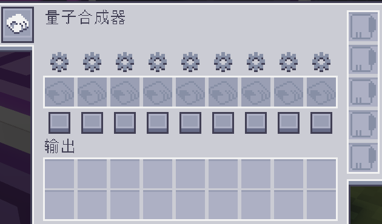
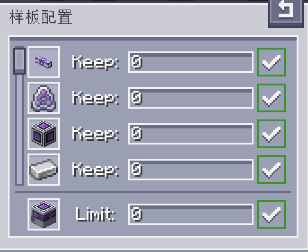

---
navigation:
  parent: aae_intro/aae_intro-index.md
  title: 量子合成器
  icon: advanced_ae:quantum_crafter
categories:
  - advanced devices
item_ids:
  - advanced_ae:quantum_crafter
---

# 量子合成器

<BlockImage id="advanced_ae:quantum_crafter" p:working="true" scale="4"></BlockImage>

量子合成器是可配置的强大自动合成器。有ME系统的整个存储空间在手，不眠不歇地合成已不算难事。只要关键资源跟得上，这种合成器便能以极快的速度执行合成任务。它还可执行流体替代合成，以及输出兼作输入的递归合成。

## 使用合成器

将量子合成器放入网络，接上线缆即可使用。合成器需占用一个频道。挑选一个想要无限执行的配方，再编入合成样板。最后将样板放入合成器中对应槽位即可。

可在界面中的两个按钮处配置插入的样板。样板下方的方形按钮可启用/禁用样板。禁用的样板永远不会被使用，启用的样板也仍需经过条件判断。可在齿轮按钮处配置这些条件。

样板配置界面中会列出所有原材料和主产物。可在输入框中调控ME系统中各个原材料应当保有的数目，以及最终产物的最大存储数目，以避免合成过量的昂贵物品。输入数目（接受数学表达式）后需按下Enter更新，右侧的指示标志可标明新输入是否已保存并应用。若将输出的限制设为0，则去除上限限制，合成任务会持续到原材料耗尽为止。

## 产物

量子合成器的产物输出可进行精细配置。默认配置下，合成器会尝试从输出槽直接向ME系统输出。左击左侧工具栏的元件标志按钮，产物便可输出至相邻的容器。启用相邻输出后还可在新按钮处选择自动输出面。这两者应当足够极为精细地控制合成器，也方便开发合成器的全新使用方法。

## 升级

量子合成器的完整潜能只在装入升级卡后显现。它接受<ItemLink id="ae2:speed_card" />和<ItemLink id="ae2:redstone_card" />。前者能大幅加快合成速度，高达每刻执行64次；后者则会启用红石控制。