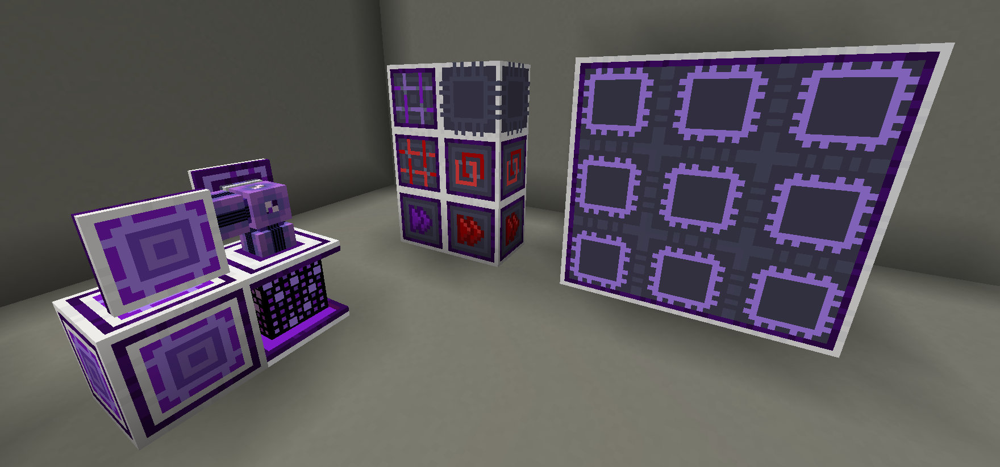

---
navigation:
  title: Advanced AE Introduction
  position: 70
---

# Advanced AE!

Advanced AE focuses on improving user experience when handling your ME System and expanding the possibilities of
end-game systems. This mod allows you to upgrade pattern providers with the capability to push items to specific sides
of the target machines and create multiblock computers that can run an unlimited amount of crafts, sharing
co-processors, while it has crafting storage left, plus a ton of other quality of life additions!

For a full list of the blocks and items provided, check these guide pages:

## Advanced Devices

<CategoryIndex category="advanced devices"></CategoryIndex>

## Advanced Items

<CategoryIndex category="advanced items"></CategoryIndex>

Found an issue? Missing a feature?
Please report it here:
[Advanced AE GitHub](https://github.com/pedroksl/AdvancedAE)