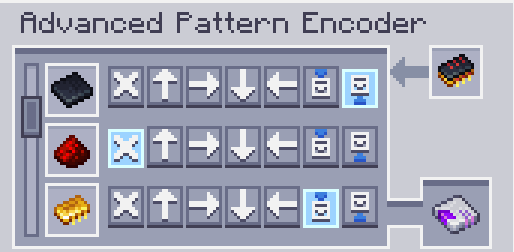

---
navigation:
  parent: aae_intro/aae_intro-index.md
  title: Advanced Pattern Encoder
  icon: advanced_ae:adv_pattern_encoder
categories:
  - advanced items
item_ids:
  - advanced_ae:adv_pattern_encoder
  - advanced_ae:adv_processing_pattern
---

# Advanced Pattern Encoder

In order to teach the ME Advanced Pattern Provider where to send your items, a special device is needed to encode that
information. You can use a right-click with it in hand to open its GUI.

<ItemImage id="advanced_ae:adv_pattern_encoder" scale="4"></ItemImage>

Encoded Processing Patterns can be inserted into the left slot, which will be decoded and all raw ingredients then
displayed in a list.

Each row contains a set of buttons that represent all possible block faces to which the ingredient
can be sent to. Leaving the Selection in the "A" button will send it to whatever face is directly connected to the
Pattern Provider, while choosing a specific face will force that to be where items will be inserted. It's important to
note that advanced patterns can only be decoded properly by <ItemLink id="advanced_ae:adv_pattern_provider" /> and will
behave like a normal pattern if used in other types of pattern provider.
Additionally, if a single item cannot be inserted in the specified face, no items will be inserted directionally and
standard pattern provider behaviour will be applied.