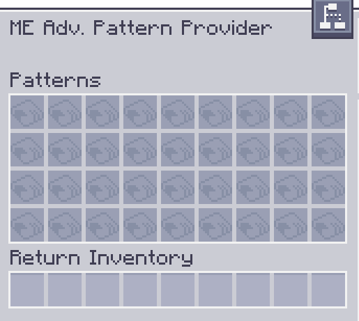

---
navigation:
  parent: aae_intro/aae_intro-index.md
  title: ME Advanced Pattern Provider
  icon: advanced_ae:adv_pattern_provider
categories:
  - advanced devices
item_ids:
  - advanced_ae:adv_pattern_provider
  - advanced_ae:small_adv_pattern_provider
  - advanced_ae:adv_pattern_provider_part
  - advanced_ae:small_adv_pattern_provider_part
---

# ME Advanced Pattern Provider

<Row gap="20">
<BlockImage id="advanced_ae:adv_pattern_provider" scale="8"></BlockImage>
<BlockImage id="advanced_ae:adv_pattern_provider" p:push_direction="up" scale="8"></BlockImage>
<GameScene zoom="8" background="transparent">
  <ImportStructure src="../structure/cable_app_part.snbt"></ImportStructure>
</GameScene>
</Row>

ME Advanced Pattern Provider is a new type of <ItemLink id="ae2:pattern_provider" /> that upgrades
a standard version or an <ItemLink id="extendedae:ex_pattern_provider" /> with the capability to configure the face to
which any individual item in a pattern will be pushed to. This powerful addition allows for automation of machines that
require specific sides for specific inputs to be done with a single block and no pipes!

*Looking at you, Mekanism.*

To be able to use this feature, you'll need to insert an <ItemLink id="advanced_ae:adv_processing_pattern" /> created
by inserting an encoded pattern in a <ItemLink id="advanced_ae:adv_pattern_encoder" /> and taking out the advanced
version.
