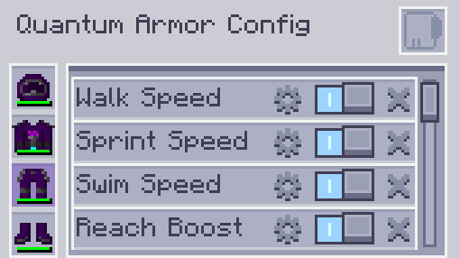

---
navigation:
  parent: aae_intro/aae_intro-index.md
  title: Quantum Armor Set
  icon: advanced_ae:quantum_helmet
categories:
  - advanced items
item_ids:
  - advanced_ae:quantum_helmet
  - advanced_ae:quantum_chestplate
  - advanced_ae:quantum_leggings
  - advanced_ae:quantum_boots
  - advanced_ae:quantum_upgrade_base
  - advanced_ae:walk_speed_card
  - advanced_ae:sprint_speed_card
  - advanced_ae:step_assist_card
  - advanced_ae:jump_height_card
  - advanced_ae:lava_immunity_card
  - advanced_ae:flight_card
  - advanced_ae:water_breathing_card
  - advanced_ae:auto_feeding_card
  - advanced_ae:auto_stock_card
  - advanced_ae:magnet_card
  - advanced_ae:hp_buffer_card
  - advanced_ae:evasion_card
  - advanced_ae:regeneration_card
  - advanced_ae:strength_card
  - advanced_ae:attack_speed_card
  - advanced_ae:luck_card
  - advanced_ae:reach_card
  - advanced_ae:swim_speed_card
  - advanced_ae:night_vision_card
  - advanced_ae:flight_drift_card
  - advanced_ae:recharging_card
  - advanced_ae:portable_workbench_card
  - advanced_ae:pick_craft_card
---

# Quantum Armor Set

<Row gap="10">
<ItemImage id="advanced_ae:quantum_helmet" scale="4"></ItemImage>
<ItemImage id="advanced_ae:quantum_chestplate" scale="4"></ItemImage>
<ItemImage id="advanced_ae:quantum_leggings" scale="4"></ItemImage>
<ItemImage id="advanced_ae:quantum_boots" scale="4"></ItemImage>
</Row>

* <ItemLink id="advanced_ae:quantum_helmet" />
* <ItemLink id="advanced_ae:quantum_chestplate" />
* <ItemLink id="advanced_ae:quantum_leggings" />
* <ItemLink id="advanced_ae:quantum_boots" />

Have you ever wondered what would it be like to wear you AE System? Well, you don't have to wonder anymore. The quantum
armor set is a highly technological stealthy apparel that connects to the AE2 system to provide convenient access to
everything on the go! By default, it's an energy powered suit with defenses comparable to Netherite gear. It is capable
of using its buffer to create an energy shield, providing a healthy amount of damage absorption. The boots also provide
fall damage negation while the chestplate can eliminate flying mining penalties. However, the true power of this suit is
only unlocked when you fill it with upgrades!

 

## Linking the Armor

The armor pieces can be individually linked to the system by inserting them into the appropriate slots in a
<ItemLink id="ae2:wireless_access_point" />. This unlocks different perks based on the gear piece and installed upgrade
cards. More on those later. Note that for these extra functionalities to work properly, you also need to be in range of
the connected access point.

 

## Installing Upgrades

To install upgrades, you need to have the pieces equipped and then open the Quantum Armor Configuration Menu, by
pressing the hotkey, (N by default).

In this screen you will be able to add/remove upgrades as well as toggle them on/off and configure settings for the
upgrades that have them.

 

## Quantum Upgrade Base Card

<ItemImage id="advanced_ae:quantum_upgrade_base" scale="2"></ItemImage>

The <ItemLink id="advanced_ae:quantum_upgrade_base" /> doesn't do anything special on its own, but it is used as a
crafting ingredient for all upgrade cards.

 

## Auto Feeding Card

<ItemImage id="advanced_ae:auto_feeding_card" scale="2"></ItemImage>

The <ItemLink id="advanced_ae:auto_feeding_card" /> enables the selection of specific items to be used to feed the
player. Simply drag the desired items into the filter slots and if the equipment is linked to the AE2 grid, it will try
to find them in the system to feed the player when hungry.

 

## Auto Stock Card

<ItemImage id="advanced_ae:auto_stock_card" scale="2"></ItemImage>

The <ItemLink id="advanced_ae:auto_stock_card" /> also requires the equipment piece to be linked to the AE2 system and
the proper range to the access point. It enables the configuration of a few stacks to be always kept at specific amounts
in the user inventory. The slots are not limited to a stack, so you can set them to have more than one slot filled in
inventory at all times if you so desire.

 

## Speed Cards

<Row gap="10">
<ItemImage id="advanced_ae:walk_speed_card" scale="2"></ItemImage>
<ItemImage id="advanced_ae:sprint_speed_card" scale="2"></ItemImage>
<ItemImage id="advanced_ae:swim_speed_card" scale="2"></ItemImage>
</Row>

* <ItemLink id="advanced_ae:walk_speed_card" />
* <ItemLink id="advanced_ae:sprint_speed_card" />
* <ItemLink id="advanced_ae:swim_speed_card" />

These upgrade cards improve the set wearer's movement speed. They all have configurable values for how fast you want to
go and also affect movement while sneaking and flying. Important to note is that these upgrades can also be used to
decrease the speed to allow for more control when other speed up effects are in place.

 

## Height Cards

<Row gap="10">
<ItemImage id="advanced_ae:jump_height_card" scale="2"></ItemImage>
<ItemImage id="advanced_ae:step_assist_card" scale="2"></ItemImage>
</Row>

* <ItemLink id="advanced_ae:jump_height_card" />
* <ItemLink id="advanced_ae:step_assist_card" />

These upgrades change vertical movement, allowing for configurable higher jump heights or step assist.

 

## Flight Cards

<Row gap="10">
<ItemImage id="advanced_ae:flight_card" scale="2"></ItemImage>
<ItemImage id="advanced_ae:flight_drift_card" scale="2"></ItemImage>
</Row>

### Flight Card

The <ItemLink id="advanced_ae:flight_card" /> enables creative flight when installed. The flight speed can be configured
using the slider in the UI. It is also affected by the walk/sprint speed upgrades additively.

### Flight Drift Card

The <ItemLink id="advanced_ae:flight_drift_card" /> only works when the Flight Card is installed, and it adds another
configuration slider to change the inertia affecting the creative flight. Lower values make you stop faster, stopping
instantly when the value is set to 0.

 

## ME Recharging Card

<ItemImage id="advanced_ae:recharging_card" scale="2"></ItemImage>

The <ItemLink id="advanced_ae:recharging_card" /> enables wireless recharging for the equipped piece. This requires a
link to the grid and being in range of the access point. Installing this upgrade in the chestplate has the added benefit
of also charging the inventory slots.

 

## Portable Workbench Card

<ItemImage id="advanced_ae:portable_workbench_card" scale="2"></ItemImage>

The <ItemLink id="advanced_ae:portable_workbench_card" /> adds a portable cell workbench to the quantum suit. To open
it, you need to press the configured hotkey. It works in the same way the block form does.

 

## Pick Craft Card

<ItemImage id="advanced_ae:pick_craft_card" scale="2"></ItemImage>

The <ItemLink id="advanced_ae:pick_craft_card" /> adds a new hotkey feature to the armor. Pressing it will attempt to
craft the block currently being targeted by the player. This feature requires that a link to the grid and a pattern
that matches the target. A popup will appear requiring the desired amount and the process follows exactly the same as a
normal auto-craft request would.

 

## Utilities Cards

<Row gap="10">
<ItemImage id="advanced_ae:night_vision_card" scale="2"></ItemImage>
<ItemImage id="advanced_ae:lava_immunity_card" scale="2"></ItemImage>
<ItemImage id="advanced_ae:water_breathing_card" scale="2"></ItemImage>
<ItemImage id="advanced_ae:magnet_card" scale="2"></ItemImage>
</Row>

* <ItemLink id="advanced_ae:night_vision_card" />
* <ItemLink id="advanced_ae:lava_immunity_card" />
* <ItemLink id="advanced_ae:water_breathing_card" />
* <ItemLink id="advanced_ae:magnet_card" />

These cards provide several utilities for the set wearer, bringing immunity to some sorts of damage and granting night
vision. The magnet card, in particular, has a configuration screen where you can set filters for what to pick up or not
and to configure its range.

 

## Defensive Cards

<Row gap="10">
<ItemImage id="advanced_ae:hp_buffer_card" scale="2"></ItemImage>
<ItemImage id="advanced_ae:regeneration_card" scale="2"></ItemImage>
<ItemImage id="advanced_ae:evasion_card" scale="2"></ItemImage>
</Row>

* <ItemLink id="advanced_ae:hp_buffer_card" />
* <ItemLink id="advanced_ae:regeneration_card" />
* <ItemLink id="advanced_ae:evasion_card" />

These upgrades provide defensive benefits to the set wearer, in various forms. The hp wearer will increase the maximum
health, while the regeneration card will increase that speed at which it recovers. The evasion card provides full
immunity to any damage source at a chance.

 

## Offensive Cards

<Row gap="10">
<ItemImage id="advanced_ae:strength_card" scale="2"></ItemImage>
<ItemImage id="advanced_ae:attack_speed_card" scale="2"></ItemImage>
</Row>

* <ItemLink id="advanced_ae:strength_card" />
* <ItemLink id="advanced_ae:attack_speed_card" />

These upgrades increase the offensive capabilities of the wearer. They provide a boost to attack damage and attack speed.

 

## Stats Cards

<Row gap="10">
<ItemImage id="advanced_ae:luck_card" scale="2"></ItemImage>
<ItemImage id="advanced_ae:reach_card" scale="2"></ItemImage>
</Row>

* <ItemLink id="advanced_ae:luck_card" />
* <ItemLink id="advanced_ae:reach_card" />

These upgrade cards provide flat stat increases to the wearer, affecting luck for better loot rolls and block reach
distance. The reach card can be configured to a specific desired value.

 

## More to come

This equipment set was release as a baseline with a ton of other features planned for release, so stay tuned!