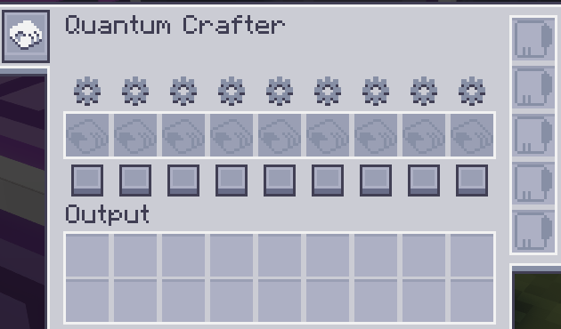
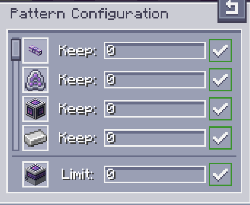

---
navigation:
  parent: aae_intro/aae_intro-index.md
  title: Quantum Crafter
  icon: advanced_ae:quantum_crafter
categories:
  - advanced devices
item_ids:
  - advanced_ae:quantum_crafter
---

# Quantum Crafter

<BlockImage id="advanced_ae:quantum_crafter" p:working="true" scale="4"></BlockImage>

The Quantum Crafter is a powerful and configurable auto-crafter. With the entire inventory of the AE systems at its
grasp, crafting non-stop becomes a trivial task. It is capable of running crafting jobs at a very fast pace while making
sure you never run out of crucial resources. It is also capable of running fluid substitution crafts as well as
recursive crafts, which have an input as an output.

## Using the Crafter

To make use of the Quantum Crafter, you need to place it into your network and connect it with a cable. A single channel
is required for operation. Select which recipes you want to be run indefinitely and encode them in a crafting pattern.
Those patterns can be inserted in the appropriate slots in the crafter.

Once inserted, there are two buttons that allow for configuration of each pattern. The square button on the bottom is
responsible for enabling/disabling a pattern. Disabled patterns will never be crafted, but enabled patterns still follow
a set of conditions. To set these conditions, you need to click the cog button to open the Pattern Configuration UI.

Inside the pattern configuration UI, all ingredients and the primary output are listed. You can use the number inputs to
regulate how much of each ingredient you want to keep inside the ME system at all times, as well as set a maximum amount
of the end product, to avoid over-crafting expensive items. After typing the desired number (which also accepts 
mathematical expressions), you need to press enter to apply the input. An indication on the right will make it clear if
values were applied or not. Particularly while configuring the output limit, if the value is set to 0 the limit is
removed and the crafting will continue until inputs run out.

## Outputs

The output of the crafts performed by the quantum crafter are highly configurable. The default configuration will try to
push items directly from the output slots to the ME system. By left-clicking the cell button on the left toolbar, the
output can be set to be pushed into adjacent inventories instead. This is further configurable by clicking the other
button that appears when this setting is enabled, that allows for the selection of which sides will be considered
enabled for auto-export. The combination of these two configurations should allow for plenty of control and creative
choice on how the crafter is used.

## Upgrades

To unlock the full potential out of the Quantum Crafter, upgrade cards must be installed. It can receive
<ItemLink id="ae2:speed_card" />s and <ItemLink id="ae2:redstone_card" />s. The former greatly accelerates the crafting
speed, reaching 64 crafts of each pattern per tick while the latter allows for redstone control.