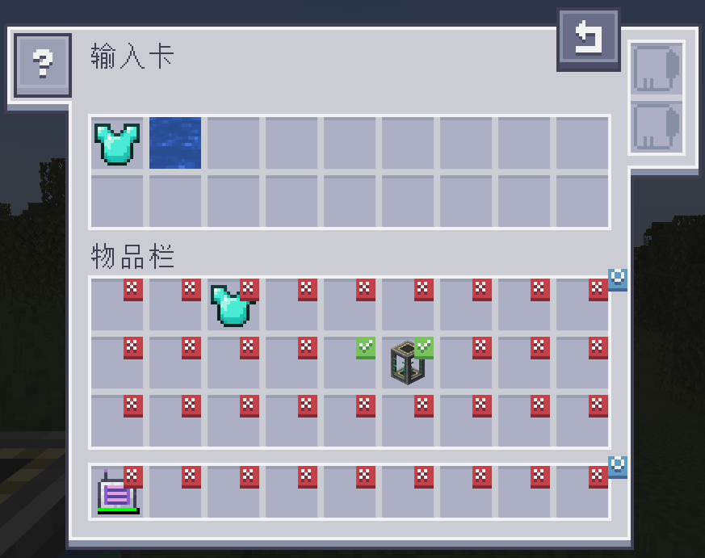
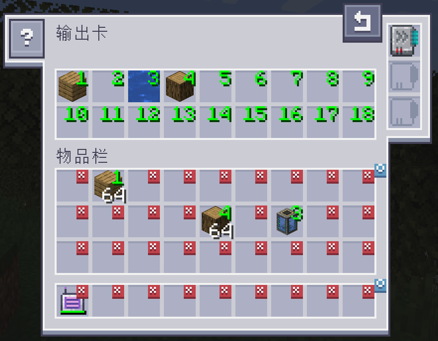

---
navigation:
  title: 附属：AE2输入输出卡
  icon: ae2importexportcard:export_card
  position: 150
categories:
  - tools
item_ids:
- ae2importexportcard:export_card
- ae2importexportcard:import_card
---

# AE2输入输出卡

<Row>
  <ItemImage id="ae2importexportcard:export_card" scale="2" />

  <ItemImage id="ae2importexportcard:import_card" scale="2" />
</Row>

输入卡和输出卡可通过玩家物品栏输入/输出物品。

## 输入卡

<ItemImage id="ae2importexportcard:import_card" scale="2" />

输入卡会将你物品栏特定槽位中的物品存入ME系统。

点击槽位可进行标记。标记槽位中的任意物品都会输入ME系统。将物品拖放到界面上方以进行过滤。

### 升级

输入卡支持如下[升级](items-blocks-machines/upgrade_cards.md)：

*   <ItemLink id="fuzzy_card" />使得该卡能按耐久度或忽略物品NBT过滤
*   <ItemLink id="inverter_card" />将白名单变为黑名单

### 配方

<RecipeFor id="ae2importexportcard:import_card" />

## 输出卡

<ItemImage id="ae2importexportcard:export_card" scale="2" />

输出卡的运作方式与输入卡完全一致，只不过是会从ME网络中抽取物品放入玩家物品栏。

从物品栏中拖动物品至界面上方的槽位，再点击物品栏中槽位，将其标号修改为上方槽位对应的数，即可规定抽取的物品种类。右击可重置为无数字。

### 升级

输出卡支持如下[升级](items-blocks-machines/upgrade_cards.md)：

*   <ItemLink id="fuzzy_card" />使得该卡能按耐久度或忽略物品NBT过滤
*   <ItemLink id="speed_card" />增加每次传输时移动的物品数，可从1个物品升级至整组物品
*   <ItemLink id="crafting_card" />使该卡能请求合成当前不可用的物品

### 配方

<RecipeFor id="ae2importexportcard:export_card" />