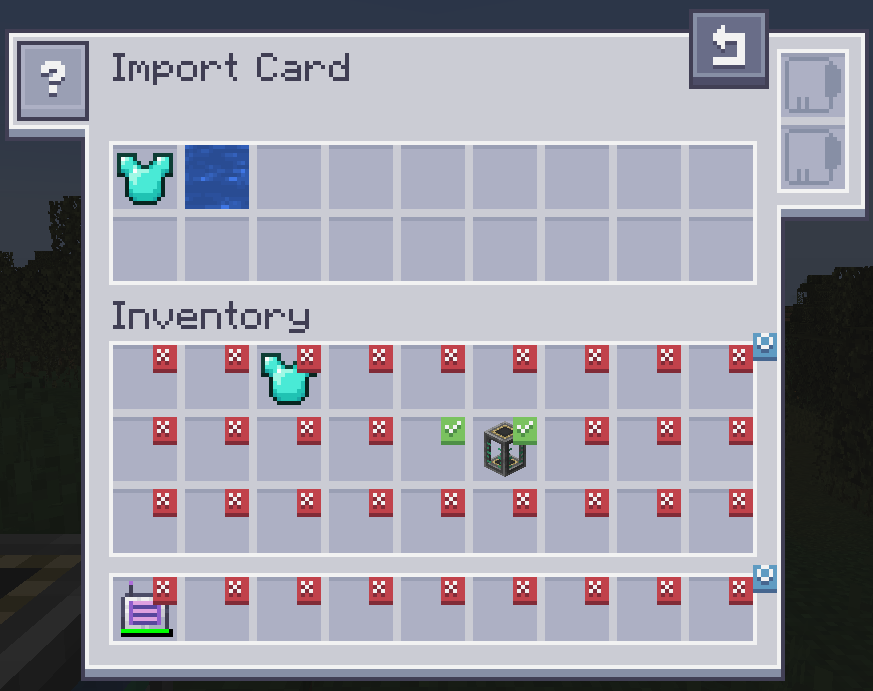
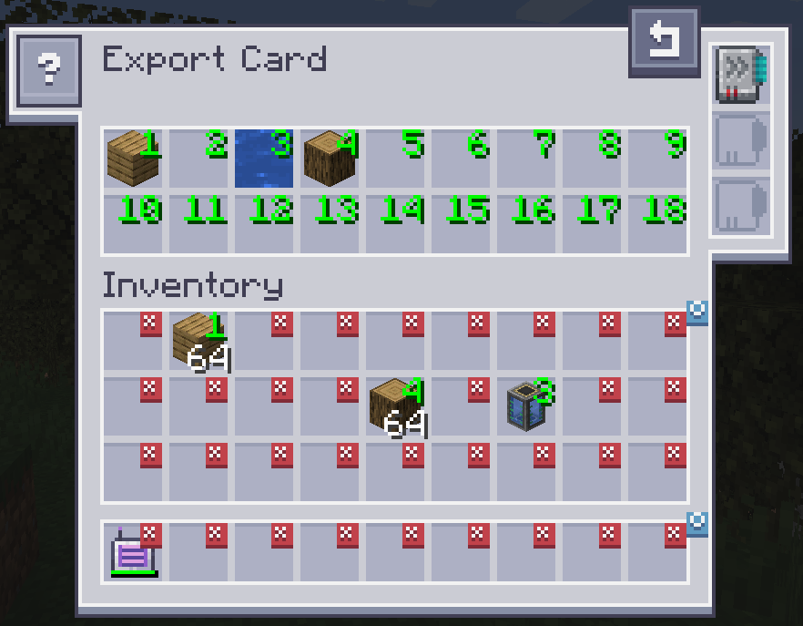

---
navigation:
  title: "Add-on: AE2 Import Export Card"
  icon: ae2importexportcard:export_card
  position: 150
categories:
  - tools
item_ids:
- ae2importexportcard:export_card
- ae2importexportcard:import_card
---

# AE2 Import Export Card

<Row>
  <ItemImage id="ae2importexportcard:export_card" scale="2" />

  <ItemImage id="ae2importexportcard:import_card" scale="2" />
</Row>

Import and Export cards allow you to import/export items out of your inventory

## Import Card

<ItemImage id="ae2importexportcard:import_card" scale="2" />

The import card takes items in specific slots of your inventory and dumps them into your ME system.

Clicking on slots makes a checkmark. Any item in the slot that has a checkmark will get imported to your ME system. Drag items from your inventory to the top to change the filter.

### Upgrades

The Import Card supports the following [upgrades](items-blocks-machines/upgrade_cards.md):

*   <ItemLink id="fuzzy_card" /> filter by damage level and/or ignore item NBT
*   <ItemLink id="inverter_card" /> switches the filter from a whitelist to a blacklist

### Recipe

<RecipeFor id="ae2importexportcard:import_card" />

## Export Card

<ItemImage id="ae2importexportcard:export_card" scale="2" />

The export card works exactly the same but will pull items from your ME system into your inventory.

To specify what items, drag the item from the inventory into one of the slots at the top and click on a slot in your inventory to change it to the desired number. Right clicking clears back to X.

### Upgrades

The Export Card supports the following [upgrades](items-blocks-machines/upgrade_cards.md):

*   <ItemLink id="fuzzy_card" /> filter by damage level and/or ignore item NBT
*   <ItemLink id="speed_card" /> improves the transfer speed from 1 to an entire stack of items
*   <ItemLink id="crafting_card" /> automatically request and craft items that are currently not available

### Recipe

<RecipeFor id="ae2importexportcard:export_card" />