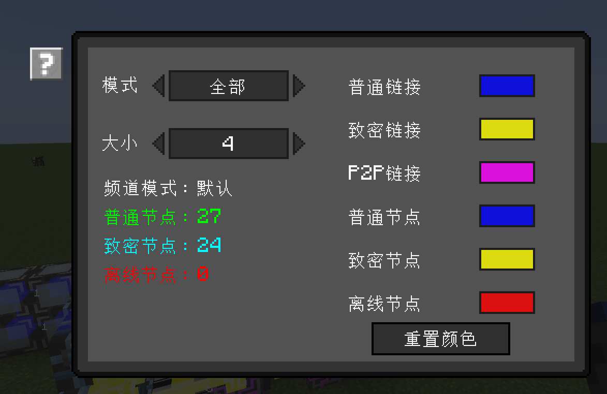

---
navigation:
    parent: ae2:items-blocks-machines/items-blocks-machines-index.md
    icon: ae2netanalyser:network_analyser
    title: ME网络分析仪
categories:
- tools
item_ids:
- ae2netanalyser:network_analyser
---

# 分析ME网络

<ItemImage id="ae2netanalyser:network_analyser" scale="4"></ItemImage>

你可否有过找不到ME网络里离线设备的苦恼？或者只是想看看网络的运作机理？欢迎使用ME网络分析仪！

## 我的ME网络是怎么运作的？

点击和ME网络相连的方块、线缆、设备，即可查看所有设备的状态，及各设备间的链接路径。

不同的颜色和形状代表不同状态。
- 蓝色方块：普通ME设备，频道数足够，最多可传递8个频道。
- 黄色方块：致密ME设备，频道数足够，最多可传递32个频道。
- 红色方块：离线ME设备，频道数不足。
- 蓝色链接：最多可传递8个频道的链接。
- 黄色链接：最多可传递32个频道的链接。
- 粉红色链接：ME P2P链接。
- 数字：经过对应链接的频道的数量。

注意，频道数的最大值实际由你的ME频道模式决定。处于无限频道模式时不会显示频道数。

## 自定义显示

可在配置GUI中更改分析模式和颜色。

ME网络分析仪有5个模式。
- 全部：显示所有网络状态。
- 节点：仅显示节点状态。
- 链接：仅显示链接状态。
- 不显示数字：不显示频道数。
- P2P：仅显示ME P2P链接。

也可在此更改节点和链接的颜色。

