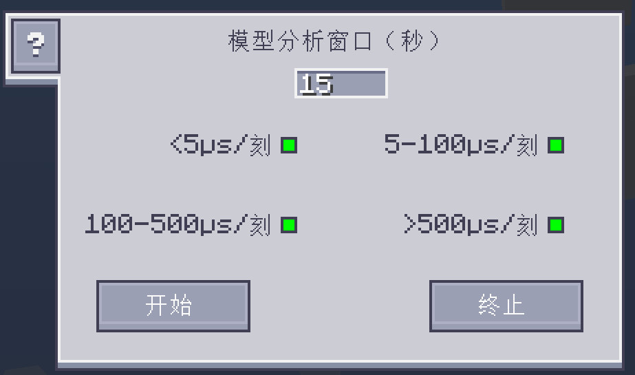

---
navigation:
    parent: ae2:items-blocks-machines/items-blocks-machines-index.md
    icon: ae2netanalyser:tick_analyser
    title: ME刻速率分析仪
categories:
- tools
item_ids:
- ae2netanalyser:tick_analyser
---

# 对ME系统的刻速率进行模型分析

<ItemImage id="ae2netanalyser:tick_analyser" scale="4"></ItemImage>

在ME网络变得非常巨大后，你的游戏可能会时不时出现卡顿，但要追踪到网络中的卡顿来源不是一件容易事。而现在，只需借助ME刻速率分析仪，就能轻松找出卡顿源。

## 是什么东西让游戏变卡的？

有些AE设备会在游戏刻中执行其功能。ME刻速率分析仪可以分析它们完成功能的耗时（μs/刻），并在世界中显示这些数据，以便你找出耗时最长的设备。

**在多人服务端中，你需要管理员权限才能使用此工具，以免出现滥用情况。**

颜色代表方块的卡顿程度。颜色越红越卡顿。

数字代表该方块的刻速率。若TPS（ticks per second，每秒刻数）低于20，你的游戏就会变卡。换言之，游戏的刻速率应时刻小于50000 μs/刻。

通常来说，大多数方块的刻速率应当小于100 μs/刻，不然它们就有可能是卡顿的来源。

## 自定义显示

可以在配置GUI中控制不同刻速率在世界中的显示方式。

绿色点选框代表显示对应刻速率范围内的方块。点击点选框可启用/禁用显示。
