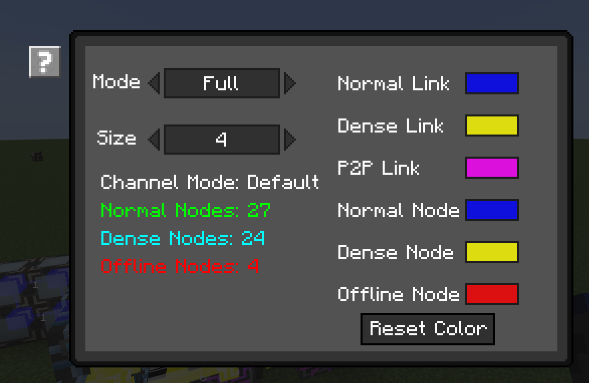

---
navigation:
    parent: ae2:items-blocks-machines/items-blocks-machines-index.md
    icon: ae2netanalyser:network_analyser
    title: ME Network Analyser
categories:
- tools
item_ids:
- ae2netanalyser:network_analyser
---

# Analyse ME Network

<ItemImage id="ae2netanalyser:network_analyser" scale="4"></ItemImage>

Have you ever suffered from finding out which device in your ME network is offline? Or just want to see how your network
is working? Here is the ME Network Analyser!

## What is going on is my ME network?

Click any block, cable or device that connect to the ME network, you will see every device's status and how they connect 
to each other.

Different colors and shapes stand for different status.
- Blue cube: Normal ME devices, they have enough channel and can pass 8 channels.
- Yellow cube: Dense ME devices, they have enough channel and can pass 32 channels.
- Red cube: Offline ME devices, they don't enough channel.
- Blue link: This link can hold 8 channels at most.
- Yellow link: This link can hold 32 channels at most.
- Pink link: It is a ME P2P link.
- Numbers: The number of channels that is carried by this link.

Notice that the maximum channel number actually depends on your ME Channel Mode. Analyser won't show channel numbers when 
Infinity Channel mode is on.

## Custom Display

You can change the analysis mode and colors in Config GUI.

ME Network Analyser has 5 modes.
- Full: Display all network status.
- Nodes: Only display node status.
- Links: Only display link status.
- No Number: Don't display channel numbers.
- P2P: Only display ME P2P links.

You also can change node or link color.

