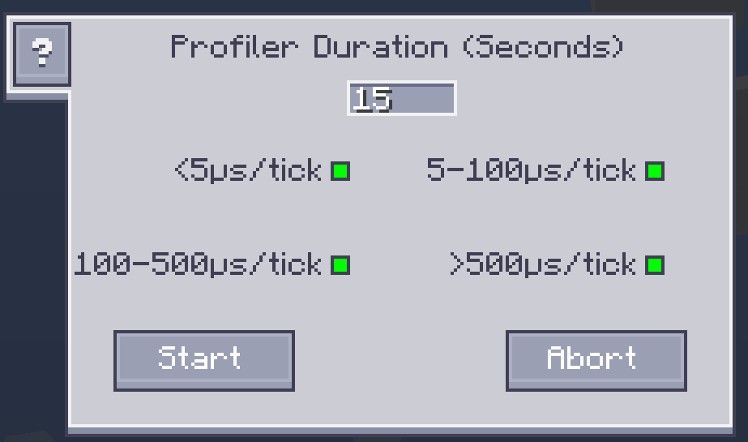

---
navigation:
    parent: ae2:items-blocks-machines/items-blocks-machines-index.md
    icon: ae2netanalyser:tick_analyser
    title: ME Tick Profiler
categories:
- tools
item_ids:
- ae2netanalyser:tick_analyser
---

# Profile ME Tick Rate

<ItemImage id="ae2netanalyser:tick_analyser" scale="4"></ItemImage>

Sometimes your game may become laggy when you have really huge ME network, but it is kinda hard to troubleshoot the lagging
source from the network. Now, you can find out what is laggy easily with ME Tick Profiler.

## What makes your game laggy?

Some AE devices will do their job during the game tick. ME Tick Profiler can measure the time (μs/tick) they need to complete 
their work and visualize the numbers in-world, which helps you find out who takes the longest time.

**You need OP permission to use it in multiplayer server for preventing abuse.**

The color stands for lagginess of the block. The redder, the laggier.

The number stands for the tick rate of this block. Your game will become laggy if TPS(ticks per second) is lower than 20.
In other words, game tick rate should always lower than 50000 μs/tick.

Generally speaking, most blocks' tick rate should be lower than 100 μs/tick, otherwise they may cause the lag.

## Custom Display

You can control the in-world display of different tick rates in Config GUI.

The green dot stands for display the blocks within the corresponding tick rate range. Click the dot to enable/disable the
display.
