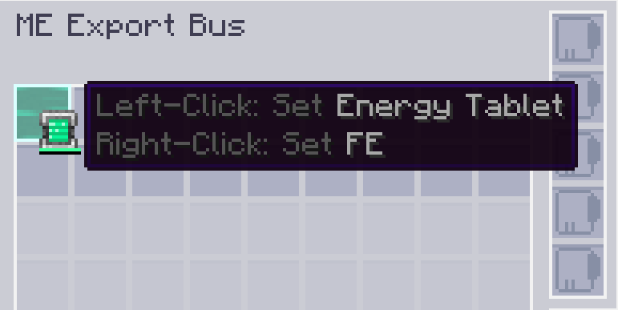

---
navigation:
  parent: appflux/appflux-index.md
  title: Mark FE
categories:
- flux tricks
---

# How to mark FE in config slot

You may want to output energy with <ItemLink id="ae2:export_bus"/>, and you need to mark FE in its config slot.

Right-click the slot with energy container to mark FE.

