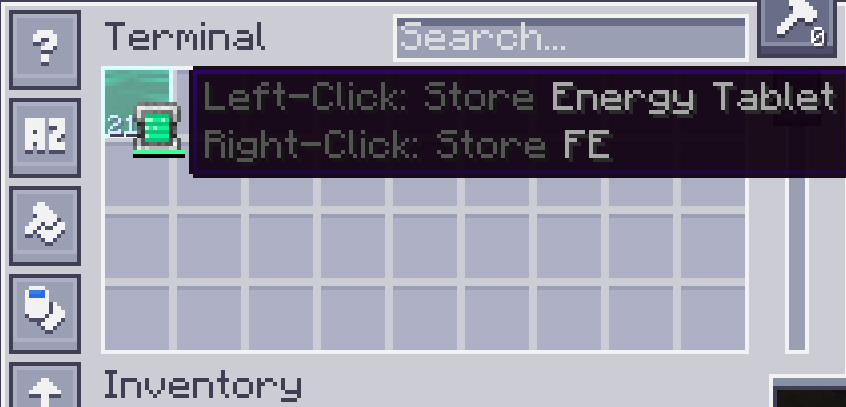

---
navigation:
  parent: appflux/appflux-index.md
  title: Terminal Interactions
categories:
- flux tricks
---

# Terminal Interactions

Terminals will display the stored energy as these *green fluid*.

These aren't real fluid, and you can't use buckets to fill it.

You can use an energy container, such as batteries, electric tools, to fill/drain energy into/from it.

