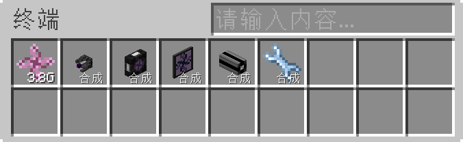
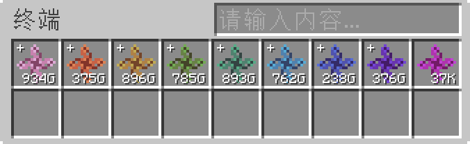

---
navigation:
  parent: appliede-index.md
  title: 转化模块
  icon: emc_module
  position: 0
categories:
  - appliede
item_ids:
  - appliede:emc_module
---

# 转化模块

<GameScene zoom="8" background="transparent">
  <ImportStructure src="assemblies/transmutation_module.snbt" />
</GameScene>

**ME转化模块**是ME网络在EMC操控和炼金术领域中的第一步。置于ME网络*任意一处*时，放置此模块的炼金术士的所有知识和能量便会对网络开放。该炼金术士的EMC会作为独立的资源进入网络，同时ME网络也能够通过自动合成及类似系统直接转化这些EMC。可转化物品会自动生成相应的合成样板，所需材料则为对应量的EMC。

网络中可存在任意多个玩家放置的任意多个模块；但每位炼金术士仅会有一个模块实际贡献EMC，也只有该模块能访问“可合成”的已习得物品。当网络中存在多个模块时，各个模块贡献的EMC值会送入同一个存储空间，且任意时刻仅会有一个模块实际进行此操作。存入和取出的EMC会在所有提供EMC的玩家间均分。

模块同时具有防ME网络溢出保险。实现方式是*层级*体系：网络中的EMC会按照一个极大的单位（10^12）分为多个层级。各层级的显示颜色与EMC的基础单位不同，用以区分。高层级可以“分解”为低层级，以便执行消耗大量EMC的转化操作。

需要注意，除去开启上述功能之外，此模块还会持续消耗25 AE/t，开支较大。具体的消耗可能会因配置的变化而改变。

## 配方

<RecipeFor id="appliede:emc_module" />
