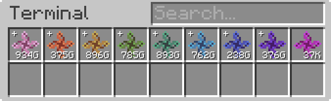

---
navigation:
  parent: appliede-index.md
  title: Transmutation Module
  icon: emc_module
  position: 0
categories:
  - appliede
item_ids:
  - appliede:emc_module
---

# Transmutation Module

<GameScene zoom="8" background="transparent">
  <ImportStructure src="assemblies/transmutation_module.snbt" />
</GameScene>

The **ME Transmutation Module** is your first step towards EMC manipulation and alchemical operations within your ME
network. When attached *anywhere* on an ME network, the module will harness the knowledge and energy of the alchemist
who placed it down and supply the network with the alchemist's EMC as a distinct resource, unlocking the ability of the
ME network to directly manipulate that EMC for transmutation of items within auto-crafting and other related operations.
These items are also provided to the network as automatically-generated crafting patterns supplied by the module, with
the equivalent EMC value used as the crafting ingredient for each item.

Multiple modules may be placed down on one network by any number of different players, but only one module per alchemist
will contribute to the stored EMC figure and available "craftable" known items. When multiple modules are present on a
network, the EMC supplied by every module is collected into one unified storage pool mounted to the network by only one
module at any given time, and any inserted and extracted EMC will be equally (as is possible) distributed among all
EMC-providing players.

The module also includes additional safeguards to prevent overflow issues in ME networks, by adding a *tier* system to
the EMC stored on a network, based on subsequent powers of an arbitrarily large number (10^12) of EMC units. Each tier
is represented by a different colour to the base unit of EMC, and can be "crafted down" into lower tiers as needed for
any of the more demanding transmutation jobs being carried out.

Be aware, however, that with the power that this module provides comes a hefty default energy cost of 25 AE/tick, maybe
more, maybe less depending on any configuration.

## Recipe

<RecipeFor id="appliede:emc_module" />
