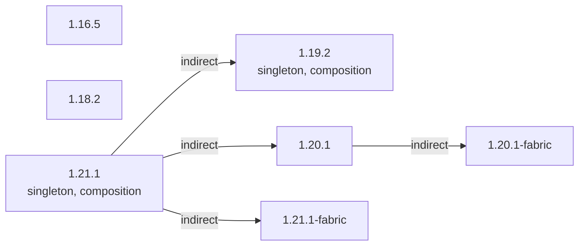

### 总概



```
1.21.1
 ├── 1.21.1-fabric
 ├── 1.20.1
 │    └── 1.20.1-fabric
 └── 1.19.2 (singleton)(composition)
1.18.2
1.16.5
```

### 传送区域

- [1.16.5](/projects/1.16/assets/chipped/chipped)
- [1.18.2](/projects/1.18/assets/chipped/chipped)
- [1.19.2](/projects/1.19/assets/chipped/chipped)
- [1.20.1](/projects/1.20/assets/chipped/chipped)
- [1.21.1](/projects/1.21/assets/chipped/chipped)
- [1.20.1-fabric](/projects/1.20-fabric/assets/chipped/chipped)
- [1.21.1-fabric](/projects/1.21-fabric/assets/chipped/chipped)